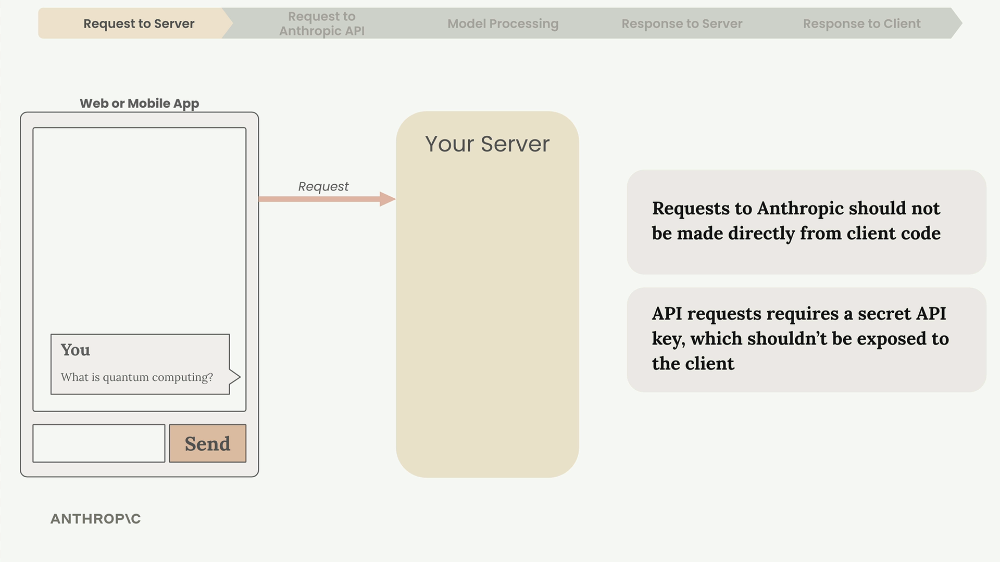
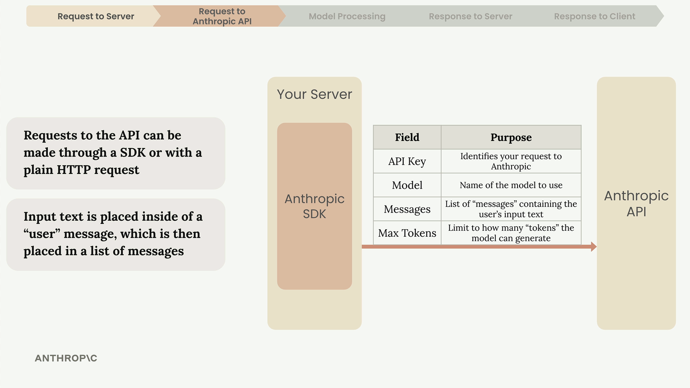
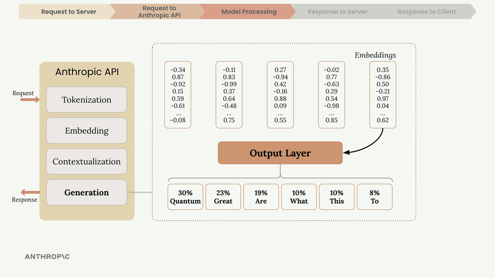

# 01a - 访问 Claude API

在正式使用 Claude 构建应用前，让我们先通过一个基本的 Chatbot 应用，理解完整的请求生命周期。理解问题发生在 pipeline 的哪个位置，有助于我们调试。

## 向服务器发送请求

应用首先向你的服务器发送请求。你不应该直接从客户端向 Anthropic 请求，因为 API 请求需要 API Key 来认证，在客户端暴露这个 Key 是一个严重的安全漏洞。

## 服务器向 Anthropic 发送请求

尽管你可以直接发送 HTTP 请求，但通常更推荐基于 SDK 请求。Anthropic 为许多主流语言提供了 SDK，包括但不限于 Python、JavaScript 和 Go。

一个典型请求通常包括如下基本字段：

- API Key：用于鉴权
- Model：要使用的模型，例如 claude-3-sonnet
- Messages：消息列表
- Max Tokens：限制 Claude 生成的 Token 数

## Anthropic 内部处理

Anthropic 部署的 Claude 模型接下来会处理你的消息，包括四个阶段。

### 分词 Tokenization

将输入文本拆分为 Token，一个 Token 可能是完整的单词、单词的一部分、空格、符号。

### 嵌入 Embedding

每个 Token 将被嵌入到一个向量（Embedding），可以理解为捕捉语义关系的一种数值定义。

### 上下文化 Contextualization

Claude 根据上下文（周围的 Token）来优化 Embedding 的值，以突出恰当的语义。

### 生成 Generation

通过输出层来计算每个 Token 的后续 Token 的概率，并选择其中某个候选项，将其添加到序列中。诸如 Claude 的 LLM 会结合概率和随机性来生成自然且多样的响应。

生成的停止条件通常为如下任一：

- 达到 Max Tokens 数限制，为你的任务设定恰当的 Token 数限制是有必要的
- 自然结束，即生成了 End Token
- 遇到了预定义的停止短语

## Claude API 响应

生成完成后，Claude API 会返回一个包含如下内容的响应：

- Message：生成的文本作为一个消息返回
- Usage：Input 和 Output Token 的用量
- Stop Reason：生成停止的原因

## 响应到客户端

最后，你的服务器按需进一步处理 Claude API 的响应，并回送给你的客户端，进行恰当的显示。尤其要注重对 Stop Reason 的处理。
