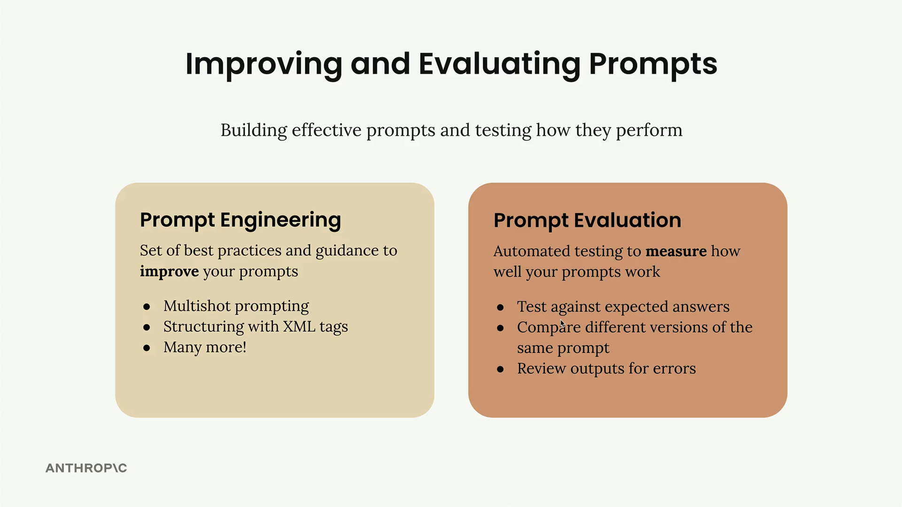
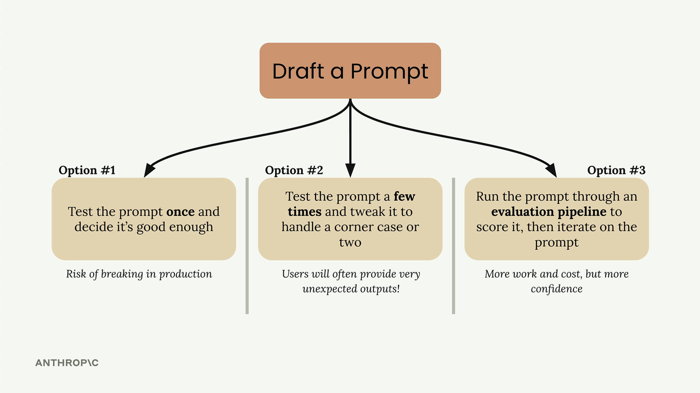

# 02a - 提示词评估介绍

在使用 Claude 等 LLM 时，良好的提示词很重要。在这里有两个概念：

- 提示词工程：帮助你写出更好的提示词
- 提示词评估：帮助你衡量提示词的实际效果

## 提示词工程和提示词评估

提示词工程包括许多技巧，例如：

- 提供 Few-shot 示例
- 使用 XML 标签进行结构化

这些技巧有助于 Claude 准确理解用户需求并生成回应。

提示词评估则关注如何通过自动化测试来衡量提示词的有效性，方法例如：

- 对照预期答案
- 比较同一提示词的不同生成结果
- 检查输出中的错误

本章节将主要关注提示词评估。

## 为什么需要提示词评估

在写完一个提示词后，有三种选择：

- 测试一次，就觉得它足够好：这是高风险的，用户给出意外输入时，容易出现故障
- 测试几次，调整提示词以处理一些边缘情况：比上一条好，但用户仍可能给出考虑以外的出乎意料的输入
- 通过评测流程进行评分，然后根据客观指标持续迭代优化提示词：需要更多工作和成本，但能让开发者对提示词的可靠性更有信心

> 开发者往往会低估真实用户会遇到多少边缘情况。当将提示词部署到生产时，用户会以从未预料到的方式与之互动。在有限的测试中看似稳固的提示词，在面对真实世界中各种输入时可能会迅速崩溃。

通过提示词评估流程，你可以在更广泛的测试用例范围内获得关于其性能的客观指标，从而：

- 在生产前识别到弱点
- 客观比较不同提示词版本
- 基于可衡量的指标有信心地迭代
- 构建更可靠、更鲁棒的 AI 应用

目标是在开发过程中发现问题，而不是在用户遇到问题后才解决。
