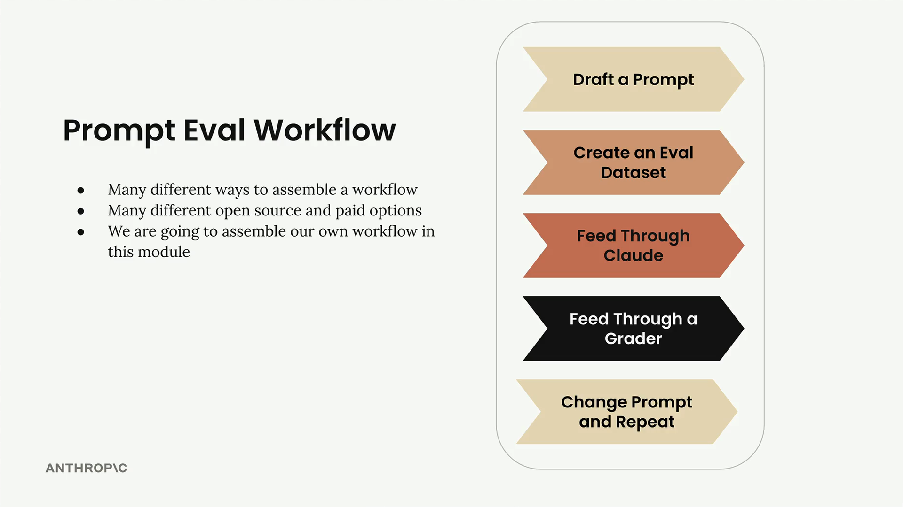

# 02b - 典型的评估流程

一个典型的提示词评估流程主要包括五个关键步骤。安排这些流程的方式有很多，也有各种各样的开源和付费根据能协助你，本教程意在帮助你理解核心流程，从而在有需要时可以按需扩展。



## 起草提示词

让我们从一个最简单提示词开始作为 baseline：

```python
prompt = f"""
Please answer the user's question:

{question}
"""
```

## 创建评测数据集

评测数据集包含示例输入，代表了在生产中将要处理的各类问题。在这个例子中，即插值到 `{question}` 的文本内容。在真实的评测中，数据集可能包含成百上千条记录。简单起见，我们先包含三个问题：

```
What's 2+2?
How do I make oatmeal?
How far away is the Moon?
```

## 让 Claude 回答

对每个数据记录，拼接出完整的提示词，发送给 Claude 获取响应。代码实现在 [02b.ipynb](https://nbviewer.org/github/z0gSh1u/build-with-claude/blob/master/main/01-accessing-claude/02b.ipynb)。

## 通过评分器

评分器为 Claude 的回答打分，通常在 1 到 10 的范围内，其中 10 代表完美答案，较低分数表示有改进空间。对于评分器的具体设计，我们会在后面的内容中讨论。

假设我们的客观评分器给出 10 分（完美答案）、4 分（需要改进）、9 分（非常好的答案），则可以用平均分作为一个客观度量：(10 + 4 + 9) ÷ 3 = 7.66。

## 迭代提示词并重复

在有了基准分数后，可以不断修改提示词并再次运行评测流程，看看性能是否提高了。例如添加一些指导，调整提示词为：

```python
prompt = f"""
Please answer the user's question:

{question}

Answer the question with ample detail
"""
```


这种系统化的方法消除了提示词工程中的尝试性猜测，并让你确信修改实际上起到了改进，而不是仅仅在生成不同的输出。
