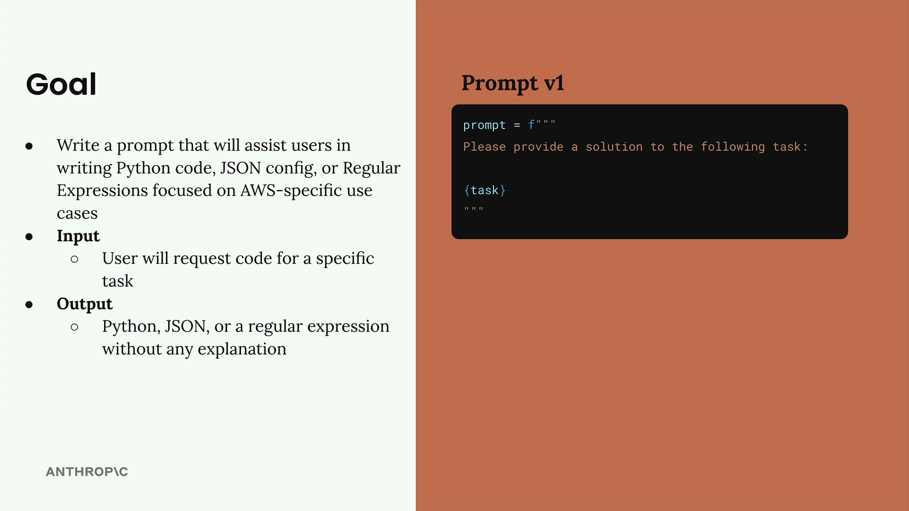

# 02c - 生成测试数据集

本节将介绍如何高效地生成用于提示词评测的数据集。我们先预设一个任务。



提示词需要帮助用户为 AWS 用例编写三种特定类型的输出：

- Python 代码
- JSON 配置文件
- 正则表达式

当用户请求帮助完成任务时，只返回上述格式之一的干净输出，不包含任何额外解释。

并给出我们的起始提示词：

```python
prompt = f"""
Please provide a solution to the following task:
{task}
"""
```

## 创建评测集

我们将评测集定义为一个 JSON 对象数组 `{ task: string }[]`。


手工创建测试数据很辛苦，不妨使用 Haiku 等相对廉价且快速的模型来帮助我们自动生成。代码实现在 [02c.ipynb](https://github.com/z0gSh1u/build-with-claude/blob/master/main/01-accessing-claude/02c.ipynb)。
