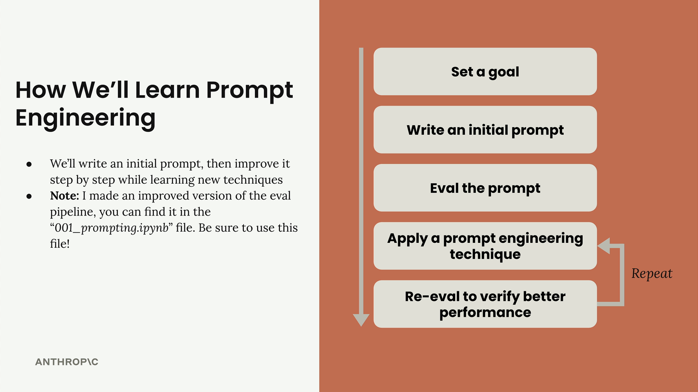
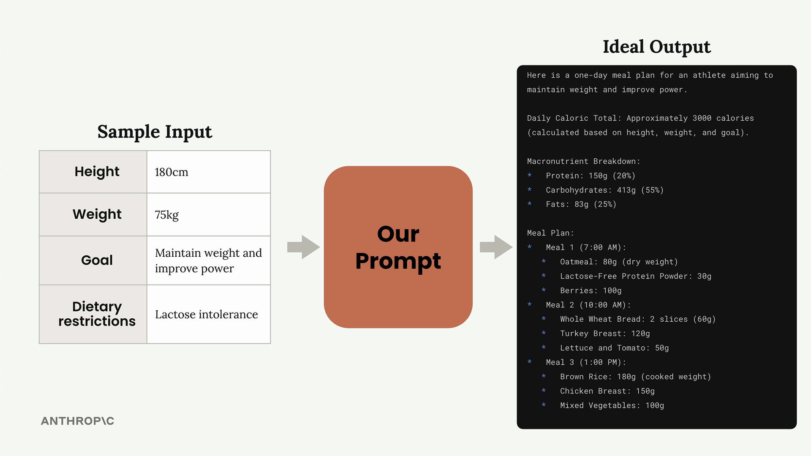

# 03a - 提示词工程介绍

提示词工程是改进提示词，以获得更可靠、更高质量的输出的过程。从基本的提示词开始，评估其性能，然后系统地应用工程技术来改进它。


## 迭代式的改进过程

包括五个步骤：

- 设定目标：弄清楚你希望你的提示词完成什么
- 撰写初始提示词
- 评估提示词：根据你的标准进行测试
- 应用提示词工程技巧
- 重新评估：验证更改是否确实改善了结果

开发者反复重复最后两个步骤，直到对性能满意为止。



## 一个例子

为了演示提示词工程过程，本节以一个例子任务进行操作：

```
创建一个生成运动员一日饮食计划的提示词。需要考虑运动员的身高、体重、目标和饮食限制，然后生成一个全面的饮食计划。
```

如下图所示：



本节的代码在 [03a.ipynb](https://github.com/z0gSh1u/build-with-claude/blob/master/main/01-accessing-claude/03a.ipynb)，其中提供了一个 `PromptEvaluator` 类来处理数据集生成和模型评分，用法如下：

```python
# 创建评测器
evaluator = PromptEvaluator(max_concurrent_tasks=5)
# 生成评测集
dataset = evaluator.generate_dataset(
    task_description="...",
    prompt_inputs_spec={...},
    output_file="dataset.json",
    num_cases=...
)
# 运行评测
results = evaluator.run_evaluation(
    run_prompt_function=run_prompt,
    dataset_file="dataset.json",
    extra_criteria="..."
)
```

我们一开始的提示词长这样：

```python
def run_prompt(prompt_inputs):
    prompt = f"""
What should this person eat?

- Height: {prompt_inputs["height"]}
- Weight: {prompt_inputs["weight"]}
- Goal: {prompt_inputs["goal"]}
- Dietary restrictions: {prompt_inputs["restrictions"]}
"""

    messages = []
    add_user_message(messages, prompt)
    return chat(messages)
```

这是我们优化的基线。现在我们添加评测标准：

```python
results = evaluator.run_evaluation(
    run_prompt_function=run_prompt,
    dataset_file="dataset.json",
    extra_criteria="""
The output should include:
- Daily caloric total
- Macronutrient breakdown
- Meals with exact foods, portions, and timing
"""
)
```

即根据用例中重要的具体要求进行评测。基于提供的框架运行评测后，将生成一个具体的评测报告，展示了每个用例的具体表现以及每个分数的推理过程。如下图所示，我们一开始的分数大概是 2.3 分：


在建立了基准后，就可以开始应用具体的提示词工程技术了。提示词工程是一个迭代的过程。关键是一次只做一个改变，评估其影响，并在有效的部分上继续改进。
