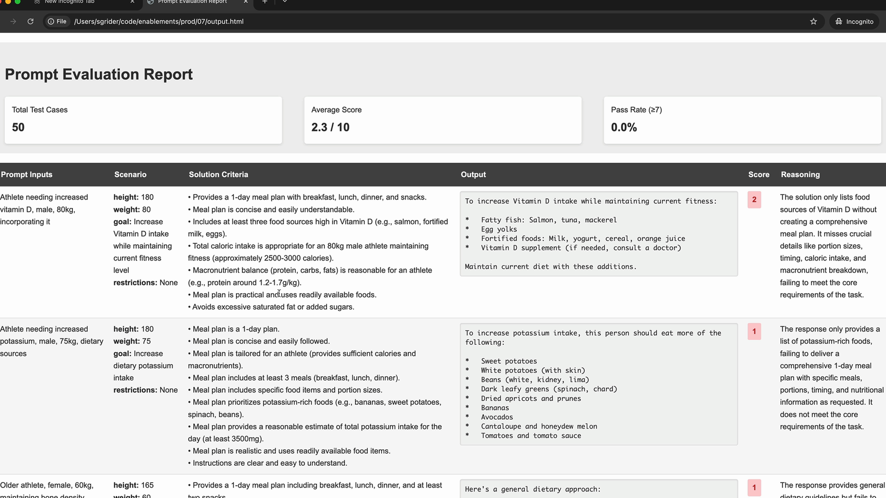

# 03a - 提示词工程介绍

提示词工程是改进提示词，以获得更可靠、更高质量的输出的过程。从基本的提示词开始，评估其性能，然后系统地应用工程技术来改进它。


## 迭代式的改进过程

包括五个步骤：

- 设定目标：弄清楚你希望你的提示词完成什么
- 撰写初始提示词
- 评估提示词：根据你的标准进行测试
- 应用提示词工程技巧
- 重新评估：验证更改是否确实改善了结果

开发者反复重复最后两个步骤，直到对性能满意为止。


## 一个例子

为了演示提示词工程过程，本节以一个例子任务进行操作：

*创建一个生成运动员一日饮食计划的提示词。需要考虑运动员的身高、体重、目标和饮食限制，然后生成一个全面的饮食计划。*

如下图所示：


本节的代码在 [03a.ipynb](./03a.ipynb)，其中提供了一个 `PromptEvaluator` 类来处理数据集生成和模型评分，用法如下：

```python
# 创建评测器
evaluator = PromptEvaluator(max_concurrent_tasks=5)
# 生成评测集
dataset = evaluator.generate_dataset(
    task_description="Write a compact, concise 1 day meal plan for a single athlete",
    prompt_inputs_spec={
        "height": "Athlete's height in cm",
        "weight": "Athlete's weight in kg", 
        "goal": "Goal of the athlete",
        "restrictions": "Dietary restrictions of the athlete"
    },
    output_file="dataset.json",
    num_cases=3
)
# 运行评测
results = evaluator.run_evaluation(
    run_prompt_function=run_prompt,
    dataset_file="dataset.json",
    extra_criteria="""
The output should include:
- Daily caloric total
- Macronutrient breakdown  
- Meals with exact foods, portions, and timing
"""
)
```

我们一开始的提示词：

```python
def run_prompt(prompt_inputs):
    prompt = f"""
What should this person eat?

- Height: {prompt_inputs["height"]}
- Weight: {prompt_inputs["weight"]}
- Goal: {prompt_inputs["goal"]}
- Dietary restrictions: {prompt_inputs["restrictions"]}
"""
    
    messages = []
    add_user_message(messages, prompt)
    return chat(messages)
```

如下图所示：




