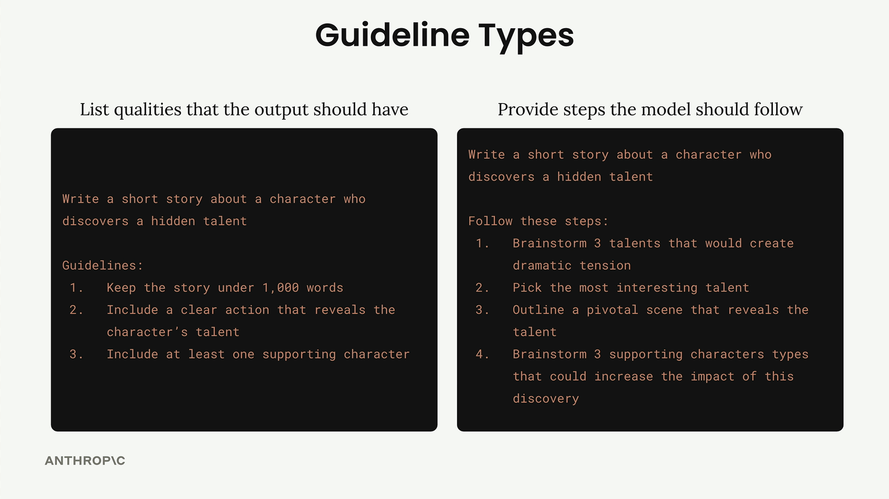

# 03c - 具体并准确

另一个优化结果的有效方法是明确你想要什么。与其将一切交给模型的理解，你可以提供清晰的 Guideline 或步骤，引导 Claude 朝着期望方向前进。


例如，如果仅仅是一句简单的提示词“写一个关于一个发现隐藏才能的角色的小故事”，则 Claude 可能会走向无数方向，例如字数从几百到几千，总角色数从一到 N，等等。如果有清晰的 Guideline，Claude 会有更清晰的目标，从而提高输出的质量。

## 编写 Guideline



Guideline 大体可分为两类，专业的 AI 应用中它们常常被一起使用。这种组合既让你在结果上保持一致性，也让你确信 Claude 在得出结论时已经考虑了所有重要因素。

### 输出质量 Guideline

此类 Guideline 用于列出模型的输出应具备的特性，从而帮助你控制：

- 响应的长度
- 响应的结构和格式
- 响应要包含的具体属性或元素
- 语气或风格要求

例如上面的故事例子，你可以指定字数不差过 1000，包含一个主角和一个配角，等等。

几乎所有的提示词都应该包含输出 Guideline，这是你获得一致且有用的结果的重要保障。

### 流程步骤 Guideline

此类 Guideline 用于为 Claude 提供具体的步骤。还是例如上面的故事例子，在生成最终响应前的思考可以分解为四步：

- 构思三个能制造戏剧性和紧张感的才能
- 挑选最有趣的才能
- 概述一个揭示该才能的关键场景
- 构思能够增强主角影响力的配角

又例如，如果让 Claude 分析销售团队表现下降的原因，则可以引导它检查市场指标、行业变化、个人表现、组织变化和客户反馈，而不是只关注一个可能的原因。

在需要 Claude：

- 系统地思考问题
- 解决复杂问题
- 进行决策
- 完成批判性思维任务
- 考虑多个角度后再给出最终响应

上述情况下，包含流程步骤 Guideline 是很有效的。

## 一个例子

还是回到我们的运动员饮食计划例子。我们提供如下 Guideline：

```
Guidelines:
1. 包含准确的每日卡路里数
2. 显示蛋白质、脂肪和碳水化合物的数量
3. 指定每餐的进食时间
4. 仅使用符合限制的食物
5. 以克为单位列出所有份量大小
6. 如果用户有要求，就保持经济实惠
```

这个输出质量 Guideline 通过明确告诉 Claude 要包含哪些元素，使评估分数从 3.92 提高到 7.86，相当有效。


