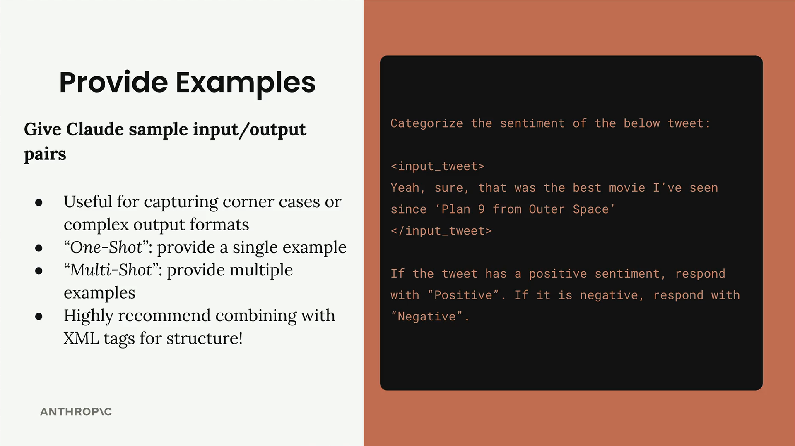

# 03d - 提供示例

在你的提示中提供示例是最有效的提示工程技术之一。这种方法被称为"单次"或"多次"提示，涉及向 Claude 提供样本输入/输出对来指导其响应。

## 如何工作

让我们以情感分析为例。假设你想让 Claude 对推文进行分类，判断其为正面还是负面：



这里的挑战是讽刺。一条像"是的，当然，那是我自《外太空九号》以来看过的最好的电影"这样的推文表面上看起来是正面的，但实际上是讽刺且负面的（《外太空九号》以著名地是史上最差的电影之一）。

要解决这个问题，你可以添加示例来展示 Claude 如何处理棘手的情况：

改进后的提示包括：

- 一个明确的正面例子："今晚的游戏太棒了！" → "正面"
- 一个讽刺的例子："哦对啊，我今晚真的需要航班延误！太棒了！" → "负面"
- 解释为什么讽刺需要谨慎对待的背景说明

注意示例是如何被包裹在像 `<sample_input>` 和 `<ideal_output>` 这样的 XML 标签中的。这种结构让 Claude 清楚地知道每个部分代表什么。

## 何时使用

例子特别适用于：

- 捕捉特殊情况或边缘场景
- 定义复杂的输出格式（如特定的 JSON 结构）
- 展示你想要的精确风格或语气
- 演示如何处理模糊的输入

单例：提供一个单一示例来建立模式

多例：提供多个示例来涵盖不同场景

当你需要处理各种边缘情况或想要展示不同类型的有效响应时，使用多示例。

不要只提供输入输出对，还要解释为什么输出是好的：这种额外的背景信息有助于 Claude 理解良好回答背后的推理，而不仅仅是格式。

```
<ideal_output>
[Your example output here]
</ideal_output>

This example is well-structured, provides detailed information 
on food choices and quantities, and aligns with the athlete's 
goals and restrictions.
```

## 最佳实践

在运行提示评估时，寻找你的最高分输出作为例子：

找到得分为 10（或你当前最高的可用分数）的回复，并将这些输入/输出对作为示例用于你的提示中。这有助于 Claude 理解针对你特定用例的"完美"输出是什么样的。

- 始终使用 XML 标签来清晰地构建你的示例
- 明确说明你展示的内容："这是一个示例输入及其理想响应"
- 包含针对你最常见的失败案例的示例
- 解释为什么你的示例输出被认为是理想的
- 保持示例与你特定的任务相关

示例特别强大，因为它们展示而非告知。你无需试图用文字精确描述你想要什么，而是直接展示出来。这使得你的提示更加可靠，并帮助 Claude 理解仅通过指令难以表达的微妙需求。


