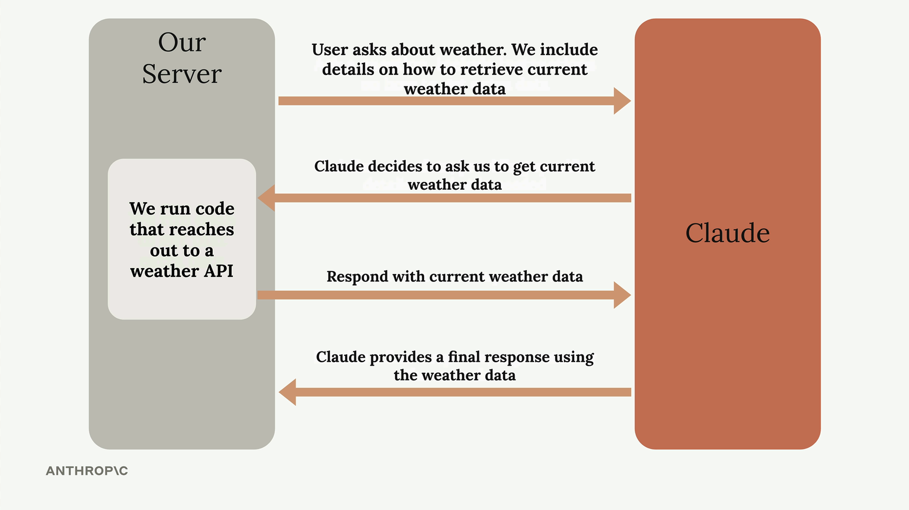

# 04a - Tool Use 介绍

工具使 Claude 能够获取外部世界的实时数据，与外部系统交互，而不是仅限于训练数据中的信息。Tool Use 就是通过为 Claude 提供一种结构化的方式，来请求和接收新鲜信息的技术。

## 为什么需要工具

例如，如果有人问 Claude“现在旧金山的天气怎么样？”，Claude 只能回答类似“抱歉，我无法获取最新的天气信息”。如果 Claude 能够获取实时数据，就能帮助用户解决这些问题。

Tool Use 使 Claude 获得了如下优势：

- 获取训练期间未提供的实时信息，如天气数据、股票价格
- 与外部系统集成，如数据库、API
- 动态响应，根据最新信息提供答案
- 结构化交互

Tool Use 使 Claude 从一个静态知识库转变为一个可以处理实时数据的动态助手，为构建需要当前信息的应用打开了可能性。

## Tool Use 的原理

Tool Use 遵循你的应用与 Claude 之间特定的来回模式，完整流程如下：

- 初始请求 Initial Request：向 Claude 发送一个问题，并附带如何从外部获取额外数据的说明
- 工具请求 Tool Request：Claude 分析问题后决定需要更多信息，表明具体需要哪些数据
- 数据检索 Data Retrieval：你的服务器运行代码，从外部数据源获取请求的结果
- 最终响应 Final Response：你将检索的数据发送回 Claude，随后它生成完整回复

以下是一个“天气问题”的例子：

- 当用户询问当前天气时，你在提示词中包含如何获取天气数据的说明
- Claude 识别出需求，并请求特定位置的天气数据
- 你的服务器调用天气 API 获取实时情况，并将数据发送回 Claude
- Claude 将最新的天气数据与用户的问题结合，提供准确且实时性好的回复
