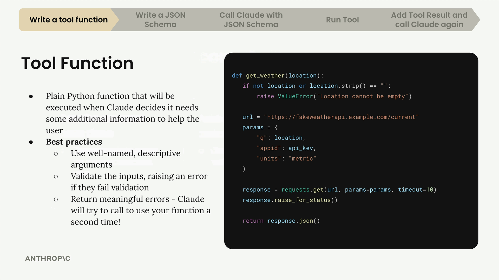

# 04c - 工具函数

Claude 可使用的工具的一种形式是可调用的 Python 函数。

## 写一个工具函数

下面是一个天气工具函数的示例。编写工具函数时，最佳实践是：

- 使用描述性名称：函数名和参数名都应明确表明其用途
- 验证输入：检查参数是否为空或无效，如果是则 raise Error
- 提供有意义的错误信息：Claude 可以看到错误信息并尝试修正调用



让我们再以获取当前日期和时间的函数为例，可以写为：

```python
def get_current_datetime(date_format="%Y-%m-%d %H:%M:%S"):
    if not date_format:
        raise ValueError("date_format cannot be empty")
    return datetime.now().strftime(date_format)
```

创建函数只是第一步，接下来需要编写 JSON Schema 来描述该函数，然后集成到 Claude 聊天系统中。这将在后面的小节中讨论。
