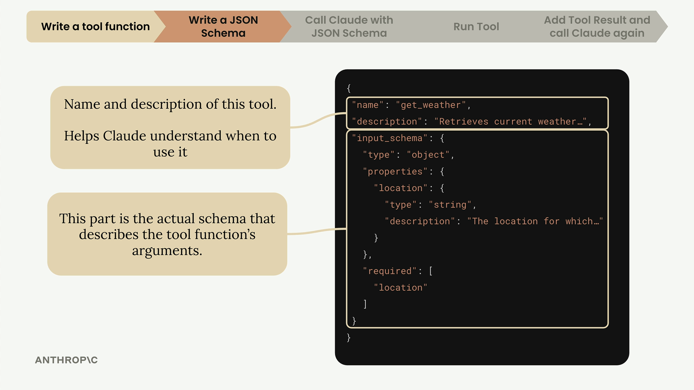

# 04d - 工具 Schema

在编写好工具函数后，下一步是创建一个 JSON Schema，充当 Claude 阅读的文档，以了解何时以及如何调用你的工具。

## 编写 JSON Schema



JSON Schema 是一种广泛使用的数据验证规范，一条完整的 Schema 包含三个主要部分：

- name：对工具清晰、描述性的名称，如 `get_weather`
- description：说明该工具的作用、何时使用，以及返回值
- input_schema：描述函数的参数

有效的 JSON Schema 的最佳实践包括：

- 用简短的 3 到 4 句话解释工具的作用
- 描述 Claude 应何时使用它
- 解释它返回何种类型的数据
- 为每个参数提供详细描述

## 用 Claude 来生成 JSON Schema

从零开始写 JSON Schema 有些繁琐，我们可以用 Claude 来生成，具体的做法是：

- 将你的工具函数代码告诉 Claude
- 将 Anthropic 关于 Tool Use 的文档添加到上下文
- 让 Claude 根据最佳实践生成一个格式正确的 JSON Schema

提示词类似于：

```
为这个函数编写一个用于 Claude 工具调用的有效的 JSON Schema。遵循附件中列出的最佳实践。
```

## 将 JSON Schema 集成到代码中

对于函数 `function_name`，通常使用 `function_name_schema` 作为存储 JSON Schema 的变量名：

```python
def get_current_datetime(date_format="%Y-%m-%d %H:%M:%S"):
    ...

get_current_datetime_schema = {
    "name": "get_current_datetime",
    "description": "Returns the current date and time formatted according to the specified format",
    "input_schema": {
        "type": "object",
        "properties": {
            "date_format": {
                "type": "string",
                "description": "A string specifying the format of the returned datetime. Uses Python's strftime format codes.",
                "default": "%Y-%m-%d %H:%M:%S"
            }
        },
        "required": []
    }
}
```

还可以使用 `anthropic.types.ToolParam` 包裹 JSON Schema，能帮助更好地进行类型检查，使代码更健壮。

