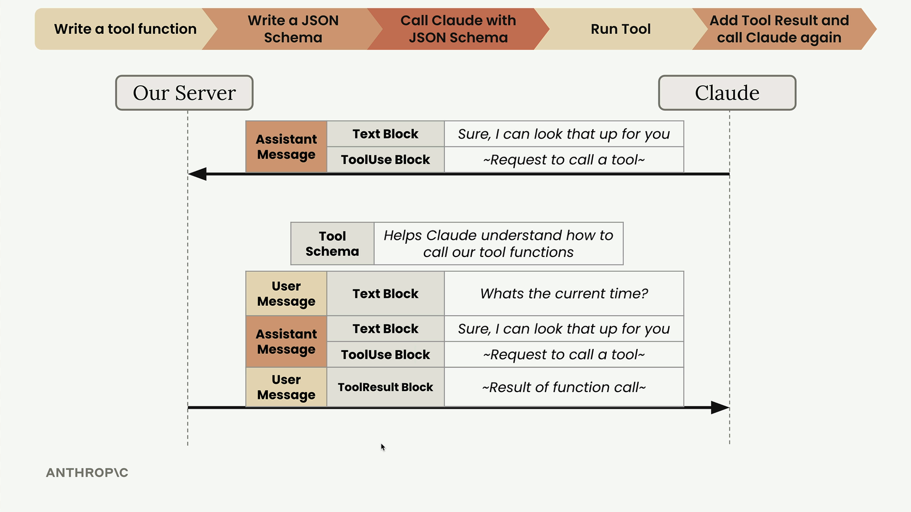

# 04f - 发送工具调用结果

在 Claude 请求工具调用后，开发者需要执行对应函数并返回结果。

## 运行工具函数

假设 Claude 响应的块结构为 `content = [textBlock, toolUseBlock]`，运行工具函数的方法则为：

```python
tool_use_block = response.content[1] # 形如 { id, input, name， type }
result = get_current_datetime(**response.content[1].input) # input 是函数调用参数的 dict
```

## 组织工具结果块

运行工具函数后，需要将结果发送回 Claude。这里需要使用一种 `type: "tool_result"` 的块，包含在用户消息中。工具结果块包含如下主要属性：

- tool_use_id：与对于的 Tool Use 块的 ID 匹配
- content：工具的输出，序列化为字符串
- is_error：当发生错误时为 True


## 多工具调用

有些时候，Claude 可能在一条助手消息中同时请求多次工具调用，即有多个 Tool Use 块。相应地，开发者需要返回多个 Tool Result 块，之间的对应关系则由 ID 确定。


## 构造后续请求

为了保持住上下文，完成工具调用后返回给 Claude 的请求需要包含完整的对话历史。因此上述 Tool Result 块实际上需要被追加到 messages 列表中，即：

```python
messages.append({
    "role": "user",
    "content": [{
        "type": "tool_result",
        "tool_use_id": response.content[1].id,
        "content": "15:04:22",
        "is_error": False
    }]
})
```

此时，完整的消息记录包含用户的原始消息、带 Tool Use 块的助手消息，以及带 Tool Result 块的用户消息。

另外，在发送后续请求时，即使你不再需要 Claude 再进行某些工具调用，也需要将历史中存在的工具的 Schema 放在 `tools` 参数中，Claude 才能理解对话历史中存在的工具是什么。



