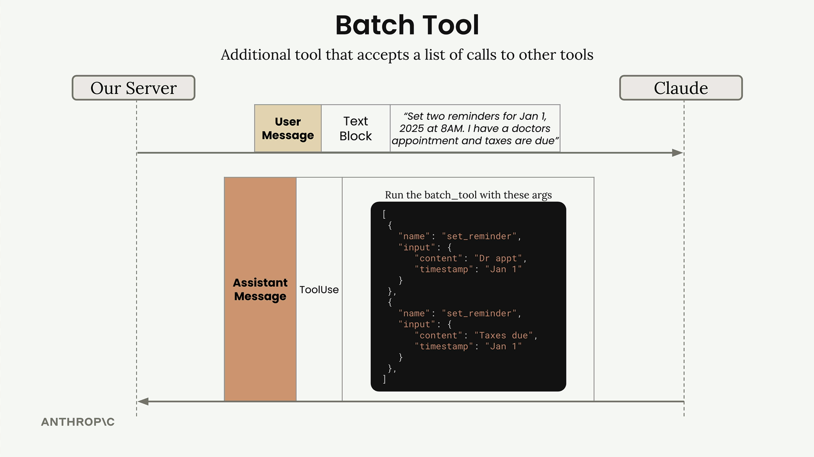

# 04j - 批处理工具

在前面的小节中，我们提到过 Claude 可以在一条助手消息中包含多个 Tool Use 块，从而并行运行多个工具。然而在实践中，Claude 常常表现为先发起第一个工具调用，等待开发者响应，然后在新一轮往返过程中再发起第二个工具调用，以此类推，这带来了不必要的 Round Trip。

解决方案是实现一个批处理工具，以鼓励 Claude 通过只调用一次它，等效地实现一次请求多个工具调用。

## 工作原理

批处理工具接受一系列调用其他工具的请求。Claude 不再直接调用多个工具，而是调用一次批处理工具，并提供参数来描述它实际想要调用的工具。



批处理工具接收一个调用列表，其中每个调用包含：

- 调用的工具名称
- 传递给该工具的参数

Schema 类似于：

```python
batch_tool_schema = {
    "name": "batch_tool",
    "description": "Invoke multiple other tool calls simultaneously",
    "input_schema": {
        "type": "object",
        "properties": {
            "invocations": {
                "type": "array",
                "description": "The tool calls to invoke",
                "items": {
                    "type": "object",
                    "properties": {
                        "name": {
                            "type": "string",
                            "description": "The name of the tool to invoke"
                        },
                        "arguments": {
                            "type": "object",
                            "description": "The arguments to pass to the tool"
                        }
                    }
                }
            }
        }
    }
}
```

开发者执行工具调用时，遍历调用列表并执行每个具体的工具调用请求：

```python
def run_batch(invocations=[]):
    batch_output = []
    for invocation in invocations: # 遍历列表中的每个调用
        name, args = invocation["name"], json.loads(invocation["arguments"]) # 提取工具名称和参数
        tool_output = run_tool(name, args) # 调用相应的工具
        batch_output.append({
            "tool_name": name,
            "output": tool_output
        }) # 将结果收集到输出列表中
    return batch_output

def run_tool(tool_name, tool_input):
    # ... 同样地，将 batch_tool 也注册到工具路由处
    elif tool_name == "batch_tool":
        return run_batch(**tool_input)
```

批处理工具为 Claude 提供了并行工具执行的更高层次抽象。这种做法看起来可能有些多余，但它常常是有效的，能够鼓励 Claude 将工具调用聚合在一起，减少 API Round Trip 次数以提高整体效率。


