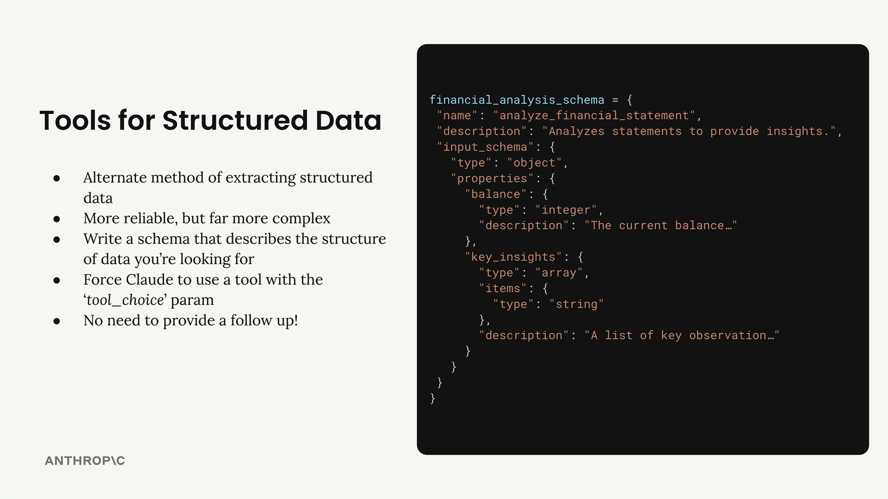

# 04k - 用于结构化数据的工具

在前面的章节，我们介绍过一种从 Claude 获取结构化数据的方法：使用消息预填充和停止序列；这种基于提示词的技术设置起来很简单，然而输出的可靠性寄希望于生成过程中 Claude 能正确地格式化响应。

本节，我们将介绍基于工具获取结构化输出的方法，此类方法通常更可靠、健壮，代价是增加了额外的复杂性。

## 结构化数据工具

基于工具的方法通过创建一个 JSON Schema 来定义开发者想要的数据结构，向 Claude 提供一个具有这些参数的可调用工具：

- 编写 Schema 描述想要的数据结构，并把它作为工具提供给 Claude
- 强制 Claude 使用这个工具
- 从 Tool Use 块中提取结构化数据
- 至此已经拥有数据，无需再提供后续的 Tool Result 块



例如上面的例子，如果想要从一份报表中提取财务余额和关键见解，Schema 中可以将它们定义为整数和字符串数组。

## 控制工具使用

这种做法的关键是确保 Claude 会调用你的工具；可以使用 `tool_choice` 参数控制这一行为：

- `{"type": "auto"}` - LLM 自己决定是否需要使用工具（默认）
- `{"type": "any"}` - LLM 必须使用任意一个工具
- `{"type": "tool", "name": "TOOL_NAME"}` - LLM 必须使用指定的工具

对于基于工具的结构化数据提取需求，通常选择第三种选项。

## 一个例子

假设你想从一篇文章中提取标题、作者和关键见解：

```python
# 首先需要创建一个工具 Schema
article_summary_schema = {
    "name": "article_summary",
    "description": "Extracts structured data from articles",
    "input_schema": {
        "type": "object",
        "properties": { # 这里描述了你期望的数据结构
            "title": {"type": "string"},
            "author": {"type": "string"},
            "key_insights": {
                "type": "array",
                "items": {"type": "string"}
            }
        }
    }
}
# 然后调用 Claude，并强制其使用这一工具
response = chat(
    messages,
    tools=[article_summary_schema],
    tool_choice={"type": "tool", "name": "article_summary"} # 注意 name 要匹配
)
# 响应中的 Tool Use 块的 input 字段就包含了结构化数据
structured_data = response.content[0].input
```

## 何时使用

- 当需要简单、快速的结构化输出时，选择基于提示词的方法
- 当需要保证可靠性，且有能力处理额外的复杂性时，选择基于工具的方法

这两种技术都很有价值，具体取决于你的特定使用场景和需求。
