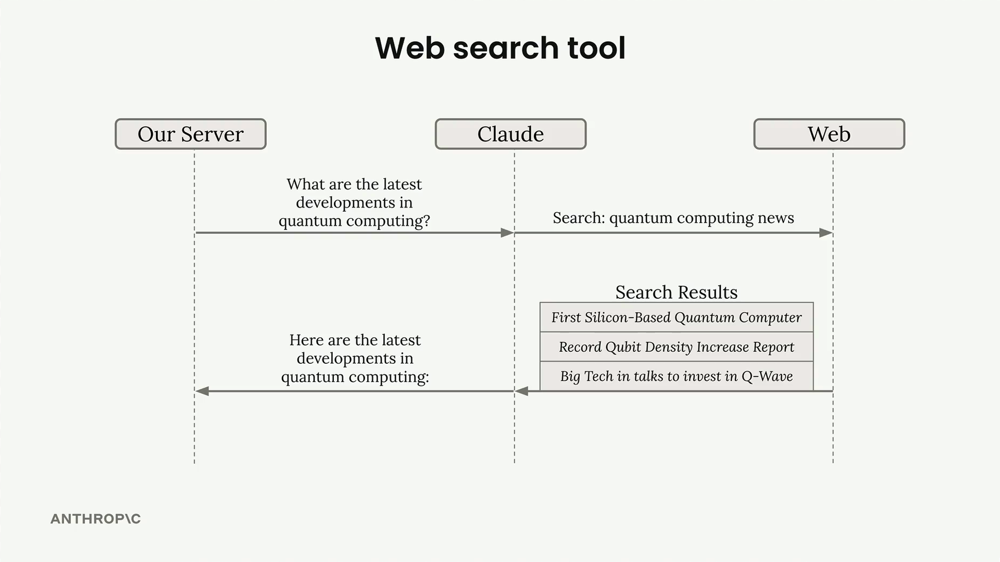

# 04n - 网络搜索工具

Claude 包含一个内置的网页搜索工具，它可以通过互联网搜索当前或专业信息来回答用户问题。与其他需要你提供实现方式的工具不同，Claude 会自动处理整个搜索过程——你只需要提供一个简单的架构来启用它。



## 设置

要使用网络搜索工具，您需要创建一个包含以下必填字段的模式对象：

```python
web_search_schema = {
    "type": "web_search_20250305",
    "name": "web_search", 
    "max_uses": 5
}
```

`max_uses` 字段限制了 Claude 可以执行多少次搜索。Claude 可能会根据初始结果进行后续搜索，所以这个字段可以防止过多的 API 调用。单次搜索会返回多个结果，但 Claude 可能会决定需要额外的搜索。

## 响应结构

当 Claude 使用网络搜索工具时，响应包含几种类型的块：

- 文本块 - Claude 对其正在做什么的解释
- ServerToolUseBlock - 显示 Claude 使用的确切搜索查询
- WebSearchToolResultBlock - 包含搜索结果
- WebSearchResultBlock - 带有标题和 URL 的单独搜索结果
- Citation blocks - 支持 Claude 陈述的文字


响应结构让你能清楚地看到 Claude 搜索了什么以及它找到了哪些来源。引用包括 Claude 用来支持其答案的特定文本，以及来源 URL。

## 搜索域限制

您可以使用 `allowed_domains` 字段将搜索限制在特定域名。当您需要可靠、权威的来源时，这特别有用：

```python
web_search_schema = {
    "type": "web_search_20250305",
    "name": "web_search",
    "max_uses": 5,
    "allowed_domains": ["nih.gov"]
}
# 例如，在询问医疗或运动建议时，限制在 PubMed（nih.gov）等特定领域内，可以确保你获得基于证据的信息，而不是随机的博客内容。
```

## 渲染搜索结果

响应中的不同块类型是为特定 UI 渲染而设计的：

- 将文本块作为常规内容渲染
- 将网络搜索结果显示为顶部来源列表
- 在文本中显示引用，包括来源域、页面标题、URL 和引用文本

这种结构帮助用户理解 Claude 是如何得出答案的，并提供了所使用来源的透明度。引用格式使具体信息来源一目了然，增强了用户对 AI 回答的信任。

## 使用场景

网络搜索工具最适合用于：

- 时事和最新发展
- Claude 训练数据中未包含的专业信息
- 事实核查和寻找权威来源
- 需要最新信息的研究任务

在调用 API 时，只需将模式包含在您的工具数组中，Claude 将自动决定何时进行网络搜索以帮助回答用户的问题。


