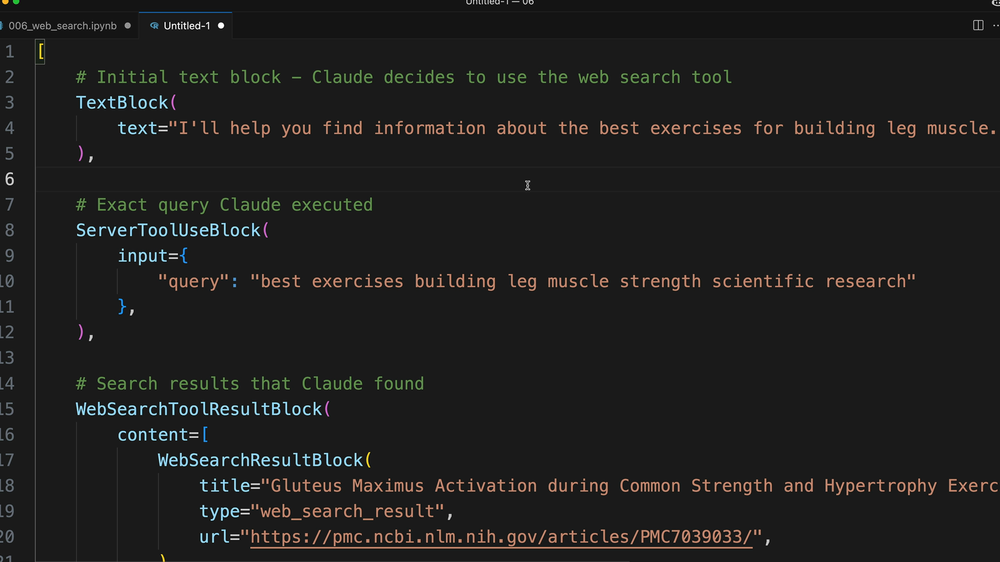

# 04n - 网络搜索工具

Claude 还内置一个网页搜索工具（Web Search Tool），使它可以通过互联网搜索最新信息或专业知识来回答用户问题。网络搜索工具不需要开发者提供实现，只要开启，Claude 就会自动处理整个搜索过程。


## 启用网络搜索工具

与文本编辑工具类似，要使用网络搜索工具，开发者需要提供一个 Schema Stub：

```python
web_search_schema = {
    "type": "web_search_20250305",
    "name": "web_search",
    "max_uses": 5
}
```

`max_uses` 限制了 Claude 最多可以执行多少次搜索，防止过多的 API 调用。根据初始搜索结果，Claude 可能会决定需要额外的搜索。

> 注：在使用该工具前，需在设置控制台 https://console.anthropic.com/settings/privacy 启用网络搜索工具。

## 响应结构

当 Claude 使用网络搜索工具时，响应包含如下几种类型的块：

- 文本块：Claude 对其行为的解释
- ServerToolUseBlock：Claude 所使用的搜索 Query
- WebSearchToolResultBlock：全体搜索结果，其 `content` 为 `WebSearchResultBlock[]`
- WebSearchResultBlock：带有标题和 URL 的单条搜索结果
- CitationBlock：从结果中引用而来的，能够支持 Claude 的陈述的文字和 URL



这种响应结构让开发者能清楚地看到 Claude 搜索了什么，以及是基于哪些来源。

## 搜索域限制

可以使用 `allowed_domains` 字段将搜索限制在特定域名。这在当需要可靠、权威的来源时很有用：

```python
# 例如在询问医疗建议时，限制在 PubMed 等特定域内，可以确保信息的循证性，而不是随意的博客内容
web_search_schema = {
    ...,
    "allowed_domains": ["nih.gov"]
}
```

## 渲染搜索结果

响应中不同类型的块能帮助实现 UI 渲染：

- 文本块：作为常规内容渲染
- 网络搜索结果：渲染为引用来源列表
- 在引用文本处显示引用，包括来源域、页面标题、URL

这种结构使具体信息来源一目了然，帮助用户理解 Claude 是如何得出答案的，增强了用户对 AI 回答的信任。

## 使用场景

网络搜索工具适合用于：

- 需要基于时事和事情的最新进展来回答
- 需要使用 Claude 训练数据中未包含的专业信息
- 需要进行事实核查，寻找权威信源
- 需要基于最新信息进行研究任务

在调用 API 时，只需将 Schema 提供到 tools 数组中，Claude 将自行决定何时进行网络搜索，以更好地回答用户的问题。
