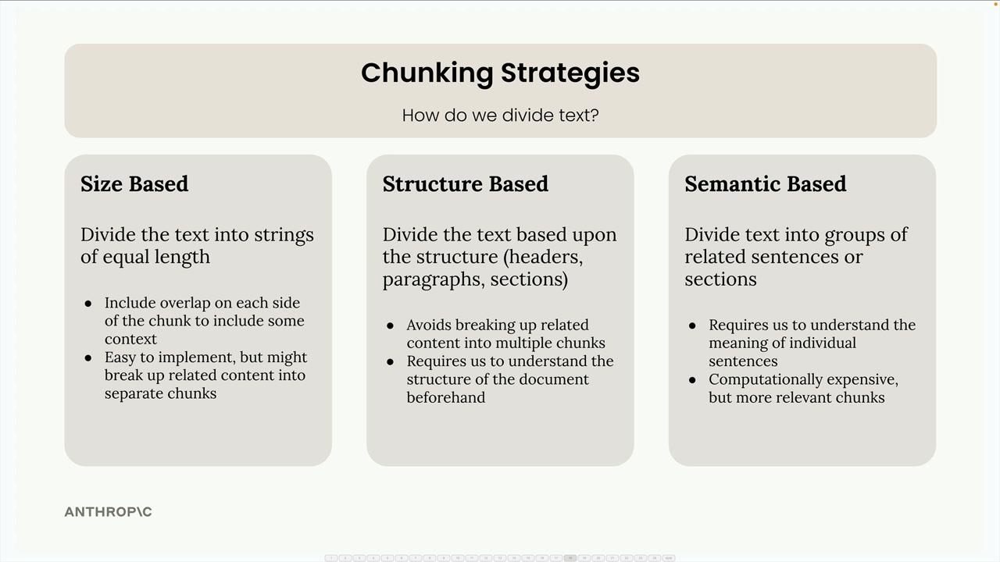
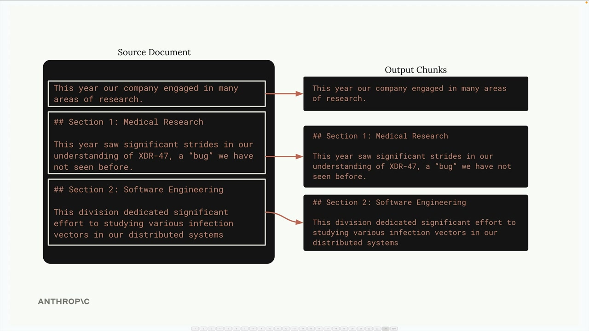

# 05b - 文本分块

文本分块是构建 RAG 系统最关键的步骤之一。不当的分块策略可能导致无关的上下文被加入到提示词中，导致 Claude 给出错误的答案。



## 基于大小的分块

这是最简单的方案，将文本分成等长的字符串。虽然容易实现，但它具有明显的缺点：

- 句子中间被截断
- Chunk 失去了周围文本的重要上下文
- 章节标题可能与内容分离


为了解决这些问题，常用的方法是在 Chunk 之间添加重叠，每个块都包含一些相邻块中的字符，以提供更好的上下文并确保单词和句子完整。

```python
def chunk_by_char(text, chunk_size=150, chunk_overlap=20):
    chunks = []
    start_idx = 0
    while start_idx < len(text):
        end_idx = min(start_idx + chunk_size, len(text))
        chunk_text = text[start_idx:end_idx]
        chunks.append(chunk_text)
        start_idx = end_idx - chunk_overlap if end_idx < len(text) else len(text)
    return chunks
```

## 基于结构的分块

基于结构的分块根据文档的自然结构，如标题、段落来划分文本。当文档具备像 Markdown 这样良好的格式时，这种方法效果很好。



```python
def chunk_by_section(document_text):
    pattern = r"\n## "
    return re.split(pattern, document_text)
```

然而，它只在你对文档结构有保证时才有效。许多现实世界的文档是纯文本或 PDF，没有明显的结构标记。

