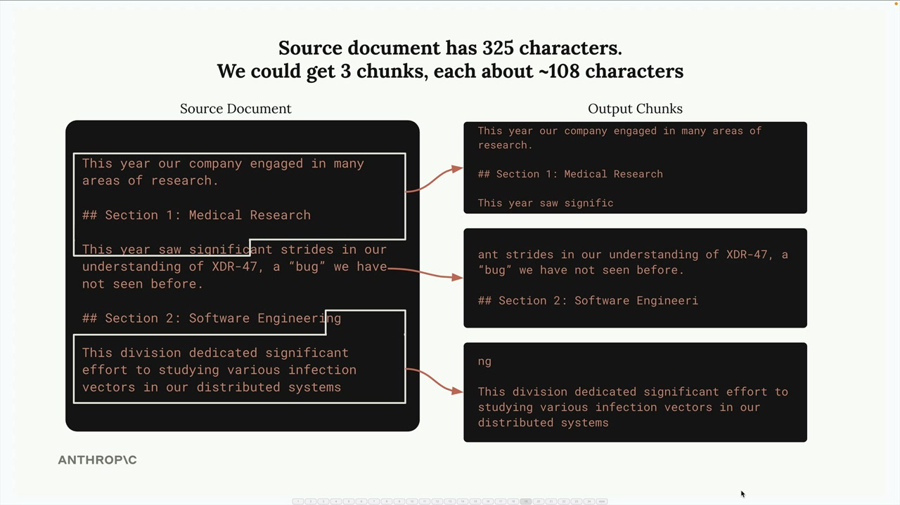

# 05b - 文本分块

文本分块是构建 RAG 系统最关键的步骤之一。不当的分块策略可能导致无关的上下文被加入到提示词中，导致 Claude 给出错误的答案。


## 基于大小的分块

这是最简单的方案，将文本分成等长的字符串。虽然容易实现，但它具有明显的缺点：

- 句子中间被截断
- Chunk 失去了周围文本的重要上下文
- 章节标题可能与内容分离



为了解决这些问题，常用的方法是在 Chunk 之间添加重叠，每个块都包含一些相邻块中的字符，以提供更好的上下文并确保单词和句子完整。

```python
def chunk_by_char(text, chunk_size=150, chunk_overlap=20):
    chunks = []
    start_idx = 0
    while start_idx < len(text):
        end_idx = min(start_idx + chunk_size, len(text))
        chunk_text = text[start_idx:end_idx]
        chunks.append(chunk_text)
        start_idx = end_idx - chunk_overlap if end_idx < len(text) else len(text)
    return chunks
```

## 基于结构的分块

基于结构的分块根据文档的自然结构，如标题、段落来划分文本。当文档具备像 Markdown 这样良好的格式时，这种方法效果很好。


```python
def chunk_by_section(document_text):
    pattern = r"\n## "
    return re.split(pattern, document_text)
```

然而，它只在你对文档结构有保证时才有效。许多现实世界的文档是纯文本或 PDF，没有明显的结构标记。

## 基于语义的分块

- 将文本分成句子，然后使用自然语言处理技术来确定连续的句子之间的关联程度
- 基于关联程度，从相关的句子形成的组来构建文本块

这种方法比较复杂，需要理解单个句子的含义，计算成本高，但能生成最相关的文本块。

## 基于句子的分块

一个实用的折中方法是按句子进行分块。例如使用正则表达式将文本分割成单个句子，然后将它们分组成带重叠的块：

```python
def chunk_by_sentence(text, max_sentences_per_chunk=5, overlap_sentences=1):
    sentences = re.split(r"(?<=[.!?])\s+", text) # 句子
    chunks = []
    start_idx = 0
    while start_idx < len(sentences):
        end_idx = min(start_idx + max_sentences_per_chunk, len(sentences))
        current_chunk = sentences[start_idx:end_idx] # 分块
        chunks.append(" ".join(current_chunk))
        start_idx += max_sentences_per_chunk - overlap_sentences # 带重叠
        if start_idx < 0:
            start_idx = 0

    return chunks
```

## 选择策略

具体选用哪种分块策略取决于你的使用场景和文档特征：

- 基于结构的分块：当文档格式可控时（如公司内部的报告）
- 基于句子的分块：对大多数文档都不错的折中方案
- 基于大小的分块：最可靠的备用方案，适用于包括代码在内的任何类型内容

需要明确的是，没有不变的最佳分块策略，而是需要根据文档特性和使用场景，在实现复杂性和分割质量之间做出权衡。
