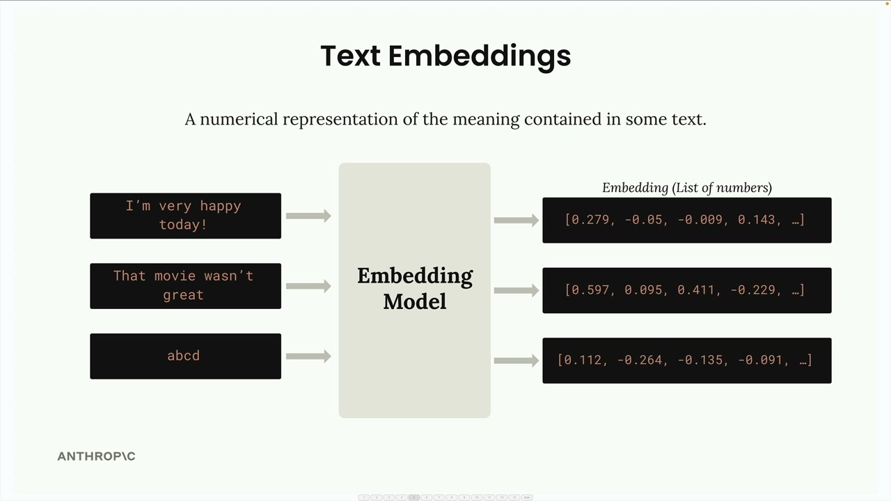

# 05c - 文本嵌入

在将文档分割成块之后，RAG 流程的下一步是找出哪些块与用户的提问最相关。

这本质上是一个搜索问题。查找相关块最常用的方法是语义搜索。与基于关键词的精确匹配搜索不同，语义搜索使用文本嵌入，来理解用户提问和文本块的含义及上下文。


## 文本嵌入 Text Embeddings

文本嵌入（的结果）是一个向量，构成了文本所包含的意义的数值表示，可以将其视为将词语和句子转换为计算机可以处理的数学格式的过程。



具体过程如下：

- 将文本输入嵌入模型（Embedding Model）
- 模型输出一个被称为“嵌入”的高维的数字向量（根据模型不同，通常输出 256 ~ 2048 维），每个数字的范围在 -1 到 +1
- 这些数字黑盒地表示了输入文本的不同特征

## 使用 VoyageAI 实现嵌入

Anthropic 目前不提供 Embedding 服务，这里使用 VoyageAI 来演示，为此需要配置环境变量：

```sh
VOYAGE_API_KEY="your_key_here"
```

本节代码实现在 [05c.ipynb](./05c.ipynb)，核心代码如下：

```python
import voyageai
load_dotenv()
client = voyageai.Client() # 初始化 VoyageAI 客户端

def generate_embedding(text, model="voyage-3-large", input_type="query"):
    result = client.embed([text], model=model, input_type=input_type) # 调用嵌入模型
    return result.embeddings[0]

chunks = chunk_by_some_method(text) # 文档分块
generate_embedding(chunks[0]) # 获得嵌入向量
```

当我们给这个函数输入一个文本块时，就会得到一个浮点数列表，即嵌入：


下一步是比较不同文本块的嵌入向量，以确定哪些片段与用户的提问最相似，这是语义搜索的核心。
