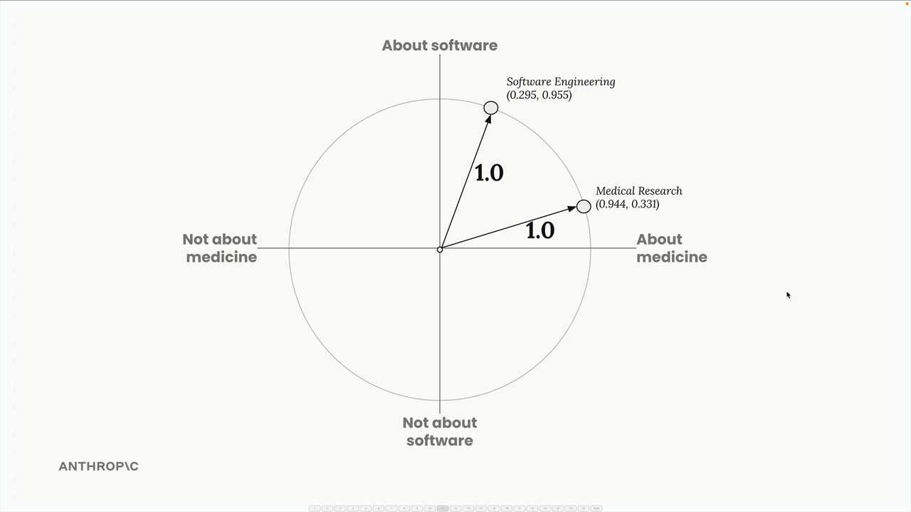
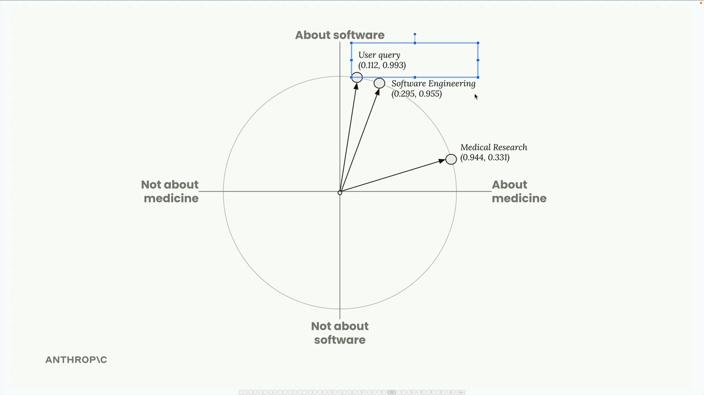
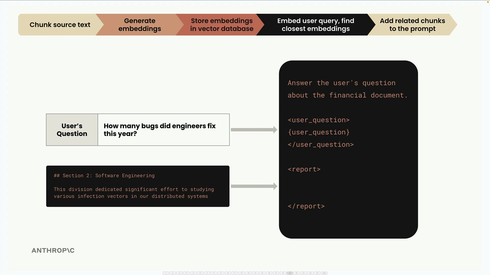

# 05d - 完整的 RAG 流程

现在我们已经了解了 RAG 的基础知识，这个例子将展示完整的 RAG 流程。

## 步骤 1：源文档分块

首先，将源文档分成文本块。在这个例子中，假设我们只有如下两个简单的文本块：

- 医学研究 - “今年，我们对 XDR-47 的了解取得了重大进展，这是一种我们之前未见过的 ‘Bug’”
- 软件工程 - “该部门投入了大量精力，研究我们的分布式系统中的各种病毒感染媒介”

## 步骤 2：生成嵌入

接下来，使用嵌入模型将文本块转换为数值嵌入。为了简化，假设嵌入模型只返回两个数字，并且我们知道每个数字代表的含义：第一个数字表示谈论医学领域的程度，第二个数字表示谈论软件工程的程度。


对于第一个文本块，假设我们得到 `[0.97, 0.34]`，专注于医学，但由于“bug”这个用词，所以也包含一些软件工程元素。对于第二个文本块，我们得到 `[0.30, 0.97]`，专注于软件，但“感染媒介”用词有一些医学寓意。Embedding API 通常会执行归一化，将向量缩放到模长为 1。我们可以在单位圆上可视化这些嵌入向量，其中每个点代表一个文本片段。



## 步骤 3：存储到向量数据库

我们将嵌入向量存储在向量数据库中。这是一种为存储、比较和搜索嵌入向量这样的高维数字列表而专门优化的数据库。至此，我们完成了所有的预处理工作，接下来等待用户提交查询。


## 步骤 4：处理用户查询

当用户提出类似“我对公司很感兴趣。特别是软件工程部门今年做了什么？”的问题时，将查询通过相同的嵌入模型进行处理。假设我们得到归一化的向量 `[0.112, 0.993]`，即医疗关联分数低，软件工程关联分数高的形式。

## 步骤 5：查找相似嵌入

我们将用户的查询的嵌入向量发送到向量数据库，使用它找到最相似的已存储的嵌入。



### 余弦相似度

向量数据库使用余弦相似度来确定哪些嵌入向量与查询最为相似。余弦相似度通过测量两个向量的夹角的余弦值来实现，即：

- 结果范围从 -1 到 1
- 接近 1 的值表示高度相似
- 接近 -1 的值表示非常不同
- 0 表示垂直（无关系）

在我们的示例中，用户查询与软件工程文本块之间的余弦相似度为 0.983——非常高，而与医学研究文本块的相似度仅为 0.398——低得多。

### 余弦距离

向量数据库文档中还经常使用“余弦距离”概念，即 `(1 - 余弦相似度)`，其：

- 接近 0 的值表示高度相似
- 更大的值意味着更低的相似度

这种变形使得数字更容易理解。

## 步骤 6：创建最终提示词

最后，我们将用户的问题和找到的最相关的文本块结合起来，形成一个提示词，将其发送给 Claude 以获取响应。



提示词可能如下所示：

```
回答用户关于财务文件的问题。

<user_question>
工程师们今年修复了多少个“Bug”？
</user_question>

<report>
## 第二部分：软件工程
该部门投入了大量精力，研究我们的分布式系统中的各种病毒感染媒介。
</report>
```

这就是完整的 RAG 流程。系统根据语义相似度检索出最相关的信息，并将其作为上下文以协助生成准确回答。
