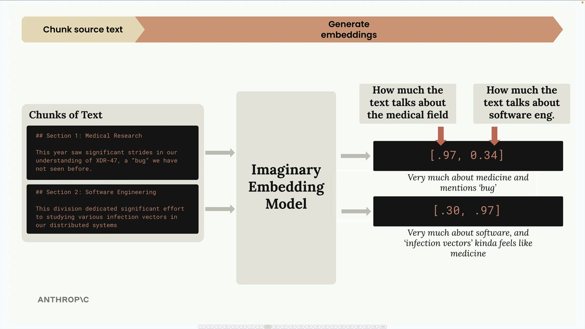
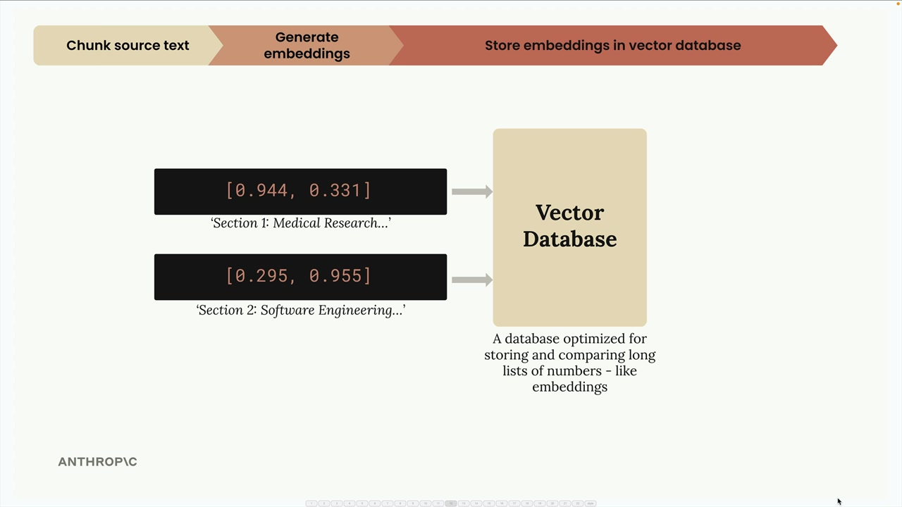

# 05d - 完整的 RAG 流程

现在我们已经了解了 RAG 的基础知识、文本分块和嵌入，让我们逐步了解完整的 RAG 流程。这个例子将展示所有这些部分如何协同工作以检索相关信息并生成响应。

## 步骤 1：分块源文本

首先，我们将源文档分解成可管理的块。在这个例子中，我们将使用两个简单的文本部分：

- 第一部分：医学研究 - "今年我们在对 XDR-47 的理解上取得了重大进展，这是一种我们之前未见过的'细菌'。"
- 第二节：软件工程 - "该部门投入大量精力研究我们分布式系统中的各种感染媒介"

## 步骤 2：生成嵌入

接下来，我们使用嵌入模型将每个文本块转换为数值嵌入。为了更容易理解，让我们想象我们有一个完美的嵌入模型，它总是返回正好两个数字，并且我们知道每个数字代表什么。



在我们的想象模型中：第一个数字代表文本谈论医学领域的程度，第二个数字代表文本谈论软件工程的程度。对于医学研究部分，我们可能会得到 `[0.97, 0.34]` - 非常专注于医学，但由于"bug"这个词，包含一些软件元素。对于软件工程部分，我们得到 `[0.30, 0.97]` - 非常专注于软件，但"感染媒介"一词带来医学暗示。

嵌入 API 通常会执行一个归一化步骤，将每个向量缩放到具有 1.0 的模量。你不需要担心这里的数学问题——这是自动处理的。这给我们提供了像 `[0.944, 0.331]` 和 `[0.295, 0.955]` 这样的归一化向量。我们可以在单位圆上可视化这些嵌入，其中每个点代表我们文本中的一个片段。


## 步骤 3：存储到向量数据库

我们将这些嵌入存储在向量数据库中——这是一种专门优化的数据库，用于存储、比较和搜索像我们的嵌入这样的长数字列表。此时，我们暂停。到目前为止，所有的工作都是预先进行的预处理。现在我们等待用户提交查询。



## 步骤 4：处理用户查询

当用户提出类似“我对公司很感兴趣。特别是，软件工程部门今年做了什么？”的问题时，我们会将他们的查询通过相同的嵌入模型进行处理。这个查询被嵌入为类似 `[0.1, 0.89]` - 低医疗分数，高软件工程分数的形式。经过归一化后，我们得到 `[0.112, 0.993]` 。

## 步骤 5：查找相似嵌入

我们将用户的查询嵌入发送到我们的向量数据库，并要求它找到最相似的存储嵌入。


数据库返回软件工程部分，因为它与用户询问的内容最为接近。

### 余弦相似度

向量数据库使用余弦相似度来确定哪些嵌入向量最为相似。这是通过测量两个向量之间的夹角的余弦值来实现的。关于余弦相似度的要点：

- 结果范围从-1 到 1
- 接近 1 的值表示高度相似
- 接近-1 的值表示非常不同
- 0 表示垂直（无关系）

在我们的示例中，用户查询与软件工程片段之间的余弦相似度为 0.983——非常高的相似度。而与医学研究片段的相似度仅为 0.398——低得多。

### 余弦距离

你会在向量数据库文档中经常看到"余弦距离"。这简单地计算为 `(1 - cosine similarity)` 。使用余弦距离：

- 接近 0 的值表示高度相似
- 更大的值意味着更低的相似度

这种调整使得在许多情况下更容易理解这些数字。

## 步骤 6：创建最终提示

最后，我们将用户的问题和我们找到的最相关的文本块结合起来，形成一个提示，并将其发送给 Claude 以获取响应。


提示可能如下所示：

```
Answer the user's question about the financial document.

<user_question>
How many bugs did engineers fix this year?
</user_question>

<report>
## Section 2: Software Engineering
This division dedicated significant effort to studying various infection vectors in our distributed systems
</report>
```

这就是完整的 RAG 流程！系统根据语义相似性成功检索了最相关的信息，并将其作为生成准确回答的上下文。
