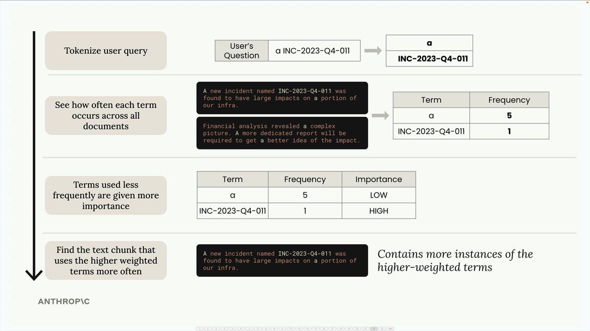
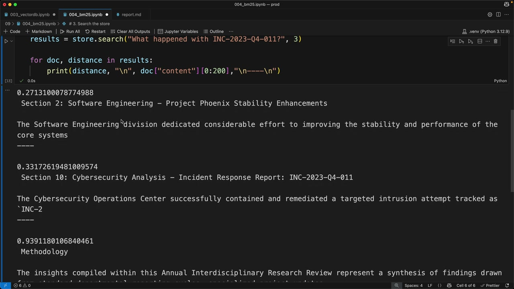

# 05f - BM25 词法搜索

在构建 RAG 流程时，人们发现仅靠语义搜索并不总能获得最佳结果。有时用户需要精确的词语匹配，而天生模糊的语义搜索可能遗漏。解决方法是使用 BM25，并将语义搜索与词法搜索结合起来。

## 仅使用语义搜索的问题

假设用户搜索文档中的一个 Case ID，如“INC-2023-Q4-011”，虽然语义搜索擅长理解上下文和含义，但它可能会返回语义相关，实际却不包含所查找的确切词语的段落。这是因为语义搜索关注的是概念相似性，而不是精确的词语匹配。

## 混合搜索策略

目前常用的解决方案是并行运行语义搜索和词法搜索，然后将结果合并：

- 语义搜索通过嵌入找到概念上相关的内容
- 词法搜索使用文本搜索查找确切的词语匹配
- 合并结果，结合两种方法以提高准确性

## BM25 搜索原理

BM25（Best Match 25）是一种在 RAG 系统中常用的词法搜索算法：

- **步骤 1：对查询进行分词**

  将用户问题拆分为单个词语。例如，“a INC-2023-Q4-011” 变为 `["a", "INC-2023-Q4-011"]`。

- **步骤 2：统计词频**

  查看每个词语在所有文档中出现的频率。如 "a" 之类的常见词可能出现 5 次，而特定词语如 "INC-2023-Q4-011" 可能只出现 1 次。

- **步骤 3：按重要性对词语加权**

  出现频率较低的词语会获得更高的重要性评分。"a" 这个词因为很常见所以重要性较低；而 "INC-2023-Q4-011" 因为罕见所以重要性较高。

- **步骤 4：查找最佳匹配**

  返回包含更多高权重词语的文档。

BM25 算法优先考虑包含特定搜索词的段落，尤其是像 Case ID 这样的罕见词所在的段落，从而比单独使用语义搜索得到更好的结果。

## 为什么这样效果更好

BM25 擅长查找精确匹配，因为它：

- 给稀有、特定的词语更高的权重
- 忽略对搜索没有什么价值的常用词
- 关注词频而非语义
- 特别适用于技术术语、ID 和特定短语

语义搜索和词法搜索具有互补的优势，前者理解上下文和含义，后者确保不会忽略精确的词语匹配。将它们结合，就能创建一个更强大的搜索系统，有效处理概念查询和具体查找。这将在后续的小节中进一步探讨。
