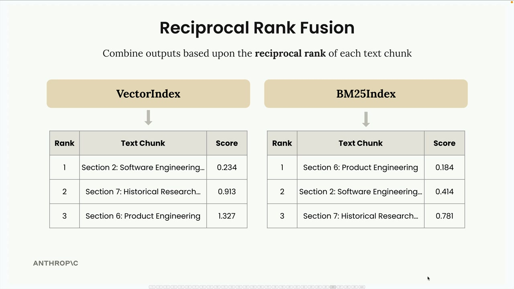
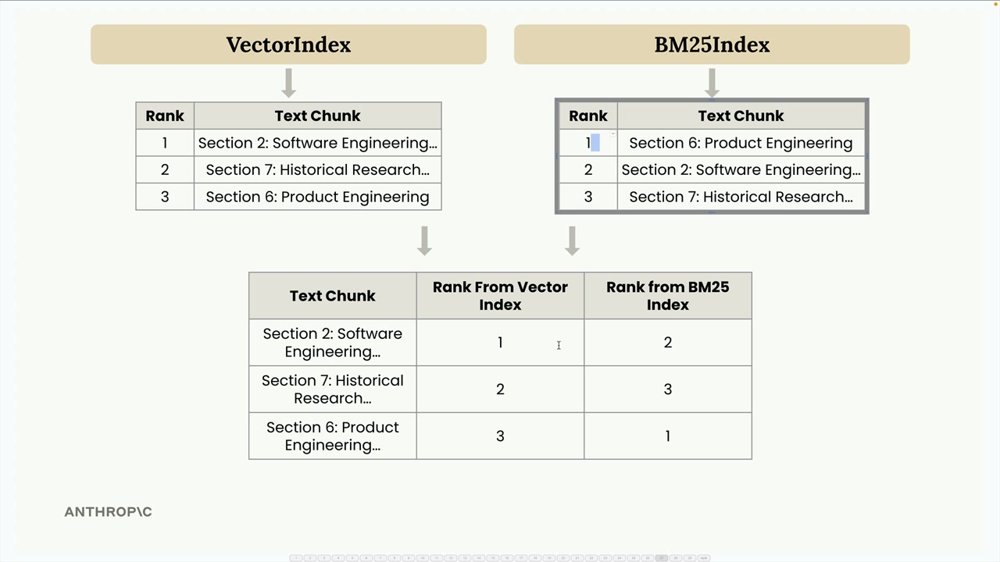
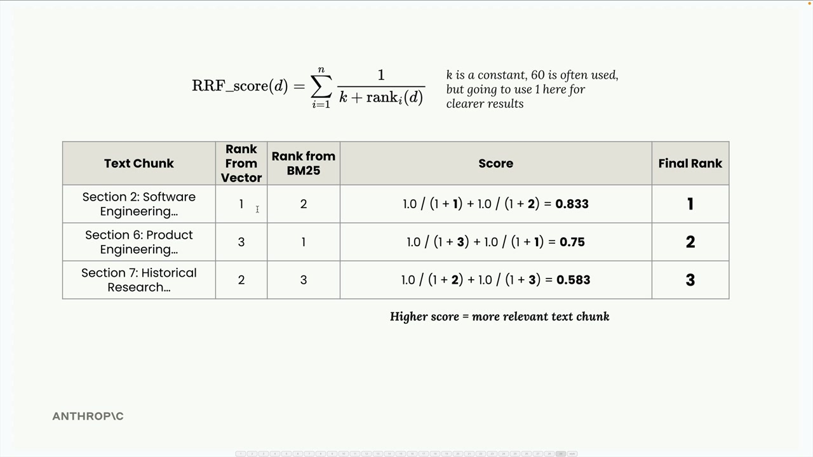
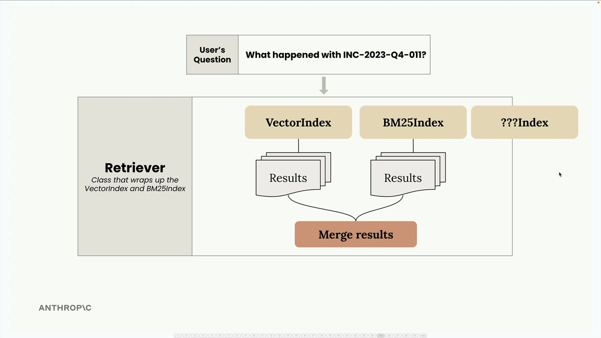

# 05f - 多索引 RAG

我们已为语义搜索（使用向量嵌入）和词法搜索（使用 BM25）分别实现了不同的方案。现在，是时候将它们结合成一个统一搜索流程，以利用两种方法的优势了。

## 多索引架构

我们的 VectorIndex 和 BM25Index 类具有几乎完全相同的 API——它们都包含 `add_document()` 和 `search()` 方法。这种一致性使得将它们包装在一起形成名为 Retriever 的新类变得非常简单。

检索器充当协调者，将用户查询转发给两个索引，收集它们的结果，并使用一种称为互惠排序融合的技术将它们合并。

## 互惠排序融合

合并不同搜索方法的结果并不像简单拼接列表那么简单。每种方法使用不同的评分系统，因此我们需要一种方法来公平地归一化和组合它们的排名。



这是互惠排名融合的工作原理，以一个例子来说明。假设我们搜索关于"INC-2023-Q4-011"的信息，并得到以下结果：

- VectorIndex 返回：第 2 节（排名 1），第 7 节（排名 2），第 6 节（排名 3）
- BM25 索引返回：第 6 节（排名 1），第 2 节（排名 2），第 7 节（排名 3）



我们将这些合并到一个表格中，显示每个文本块在两个索引中的排名，然后应用 RRF 公式：

$$
{\rm RRF_{score}}(d) = \sum_i \frac{1}{k+{\rm rank}_i(d)}
$$

其中 k 是一个常数（通常为 60，但为了更清晰的结果我们将使用 1），rank_i(d)是文档 d 在 i-th 排名中的排名。对于我们的示例：



最终排序结果为：第 2 节（0.833），第 6 节（0.75），第 7 节（0.583）。这很符合直觉——第 2 节在两个索引中都表现良好，因此排在最前面。

## 实现细节

检索器类封装了多个搜索索引，并提供了一个统一的接口：

```python
class Retriever:
    def __init__(self, *indexes: SearchIndex):
        if len(indexes) == 0:
            raise ValueError("At least one index must be provided")
        self._indexes = list(indexes)

    def add_document(self, document: Dict[str, Any]):
        for index in self._indexes:
            index.add_document(document)

    def search(self, query_text: str, k: int = 1, k_rrf: int = 60):
        # Get results from all indexes
        all_results = []
        for idx, results in enumerate(all_results):
            for rank, (doc, _) in enumerate(results):
                # Track document ranks across indexes
                # Apply RRF scoring formula
        # Return merged and sorted results
```

关键洞察在于，通过在不同搜索实现中保持一致的 API，我们可以轻松地将它们组合起来，而无需紧密耦合。

## 测试混合方法

还记得我们之前遇到的问题吗？当搜索"INC-2023-Q4-011 发生了什么？"时，仅使用向量方法返回了不符合预期的结果？网络安全事件（第 10 节）先出现，但财务分析（第 3 节）却排在更相关的软件工程部分之前。

通过我们的混合检索器，我们现在得到了更好的结果：

- 第 10 节：网络安全分析 - 事件响应报告（最相关）
- 第二节：软件工程 - 项目凤凰稳定性增强（第二相关）
- 第五节：法律发展（三）

这展示了如何通过结合语义搜索和词汇搜索来克服单独使用任何一种方法的局限性。

## 可扩展性



这种架构的美在于其可扩展性。由于所有索引都实现了相同的 SearchIndex 协议，并包含 `add_document()` 和 `search()` 方法，因此您可以轻松地添加新的搜索方法：

想添加基于关键词的索引？基于图的搜索？特定领域的索引？只需实现相同的接口，检索器就会自动将其整合到融合过程中。

这种模块化方法使每个搜索实现保持专注且可测试，同时提供了一种清晰的方式，将它们的优势结合在最终系统中。
