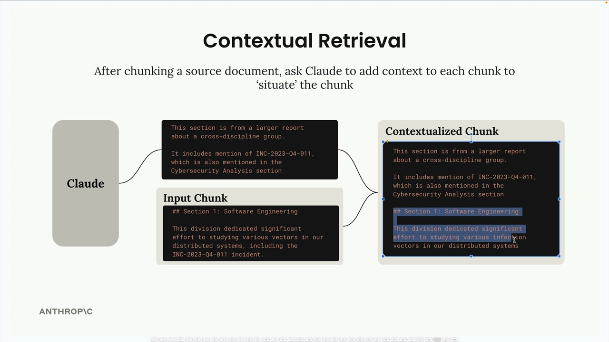

# 05i - 上下文检索

上下文检索通过解决“将文档分割成片段时，每个片段都会失去与更广泛的文档上下文的联系”这个问题，来提高 RAG 流程的准确性。

## 分块的问题

当将源文档分块存入向量数据库时，每个单独的片段无从知道它来自哪里以及如何与文档的其他部分相关联。即：文本块缺乏重要的上下文信息，导致检索的准确性降低。

## 上下文检索如何工作

上下文检索在将文本块插入数据库之前增加了一个预处理步骤，称为“上下文化”：

- 获得每个单独的片段和对应的源文档
- 将两者都发送给 Claude，并附上特定的提示词
- 让 Claude 写一段简短的文字，能够体现片段在源文档中的大体位置
- 将此上下文与原始片段结合，得到“上下文化的片段”
- 在向量检索和 BM25 检索中使用上下文化的片段

其中的提示词要求 Claude 分析文本块，并写出解释该文本块与整个文档关系的背景信息。后文中提供了一个示例提示词。



## 处理大型文档

一个常见的问题是源文档太大而无法放入 Claude 的单个提示词，此时可以提供一组简化的上下文，通常包括：

- 源文档开头的几个片段，通常包含摘要、概要
- 当前文本块之前一系列文本块
- 跳过与当前文本块关联性较低的中间文本块


## 实现示例

本节的相关代码实现在 [05i.ipynb](https://github.com/z0gSh1u/build-with-claude/blob/master/main/01-accessing-claude/05i.ipynb)，关键代码如下：

```python
def add_context(text_chunk, source_text):
    prompt = """
    写一个简明的上下文片段，将此文本块关联（定位）到整个源文档中，从而改善该部分的检索。

    这是源文档：
    <document>
    {source_text}
    </document

    这是要在文档中定位的片段：
    <chunk>
    {text_chunk}
    </chunk>

    仅回答简明的上下文片段，不要包含其他内容。
    """
    messages = []
    add_user_message(messages, prompt)
    result = chat(messages)

    return result["text"] + "\n" + text_chunk

# 如果需要提供简化的上下文，可以做下列计算
num_start_chunks, num_prev_chunks = 2, 2

for i, chunk in enumerate(chunks):
    context_parts = []
    context_parts.extend(chunks[: min(num_start_chunks, len(chunks))]) # 开头文本块
    start_idx = max(0, i - num_prev_chunks)
    context_parts.extend(chunks[start_idx:i]) # 相近的前序文本块
    context = "\n".join(context_parts)
    contextualized_chunk = add_context(chunk, context) # 上下文化
    retriever.add_document({"content": contextualized_chunk})
```

## 期望的结果

当使用上下文检索时，结果将包括生成的补充上下文和原始的片段。例如，一个上下文化的片段可能像：“这个片段是年度跨学科研究综述的第 2 部分，详细介绍了在 XX 项目中，为解决稳定性问题而做的软件工程方面的工作…”，然后是原始文本块。

这种技术在处理复杂文档时特别有价值。补充的上下文有助于检索系统更好地理解每个片段的内容以及它与更广泛的文档的关系，有助于在搜索查询与片段的原始文本不完全匹配的情况下也能检索到相关片段。
