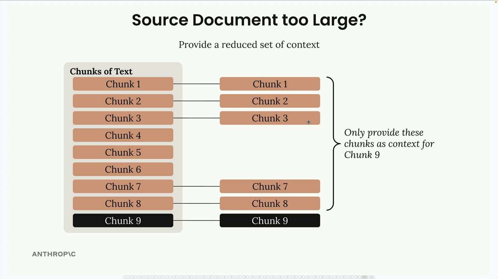

# 05i - 上下文检索

上下文检索是一种通过解决一个基本问题来提高 RAG 流程准确性的技术：当你将文档分割成多个片段时，每个片段都会失去与更广泛文档上下文的联系。

## 分块的问题

当你将源文档拆分成块以存入你的向量数据库时，每一块将不再知道它来自哪里，或者它如何与文档的其他部分相关联。这会损害检索的准确性，因为块缺乏重要的上下文信息。

## 上下文检索如何工作

上下文检索在将数据块插入检索器数据库之前增加了一个预处理步骤。以下是该过程：

- 取每个单独的片段和原始源文档
- 将两者都发送给 Claude，并附上特定的提示
- 请让 Claude 写一个简短的片段，将这个片段定位在整篇文档的总体位置
- 将此上下文与原始片段结合，创建一个"上下文化片段"
- 在您的向量和 BM25 索引中使用上下文化片段


提示要求 Claude 分析文本块，并写出解释该文本块与整个文档关系的背景信息。例如，如果你有一个关于软件工程的章节提到了 2023 年的一起事件，Claude 可能会生成背景信息，解释这一章节来自一份更大的报告，并且同一事件在其他章节中也有提及。

## 处理大型文档

一个常见的问题是当你的源文档太大而无法放入 Claude 的单个提示中时。在这种情况下，你可以提供一组简化的上下文，而不是整个文档。



策略是包括：

- 文档开头的几个片段（通常包含摘要或概要）
- 你正在进行上下文关联的 chunk 之前立即的 chunk
- 跳过与当前 chunk 关联性较低的中间 chunk

## 实现示例

```python
def add_context(text_chunk, source_text):
    prompt = """
    Write a short and succinct snippet of text to situate this chunk within the
    overall source document for the purposes of improving search retrieval of the chunk.
    
    Here is the original source document:
    <document>
    {source_text}
    </document>
    
    Here is the chunk we want to situate within the whole document:
    <chunk>
    {text_chunk}
    </chunk>
    
    Answer only with the succinct context and nothing else.
    """
    
    messages = []
    add_user_message(messages, prompt)
    result = chat(messages)
    
    return result["text"] + "\n" + text_chunk

# 对于处理具有有限上下文的多个块，您可以选择特定的块来包含：
# Add context to each chunk, then add to the retriever
num_start_chunks = 2
num_prev_chunks = 2

for i, chunk in enumerate(chunks):
    context_parts = []
    
    # Initial set of chunks from the start of the doc
    context_parts.extend(chunks[: min(num_start_chunks, len(chunks))])
    
    # Additional chunks ahead of the current chunk we're contextualizing
    start_idx = max(0, i - num_prev_chunks)
    context_parts.extend(chunks[start_idx:i])
    
    context = "\n".join(context_parts)
    
    contextualized_chunk = add_context(chunk, context)
    retriever.add_document({"content": contextualized_chunk})
```

## 期望结果

当您使用上下文检索进行搜索查询时，您将获得包括生成的上下文和原始片段内容的结果。上下文有助于检索系统更好地理解每个片段的内容以及它与更广泛文档的关系。

例如，一个上下文化的片段可能以以下内容开始：“这个片段是年度跨学科研究综述的第2部分，详细介绍了在凤凰项目解决稳定性问题的软件工程努力...”然后是原始片段的文本。

这种技术在处理复杂文档时特别有价值，因为单个部分有许多相互联系和对文档其他部分的引用。增加的上下文有助于确保即使在搜索查询与片段的原始文本不完全匹配的情况下，也能检索到相关的片段。
