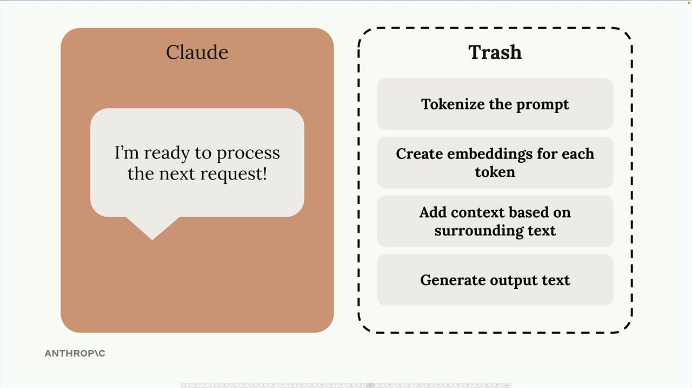

# 06e - 提示词缓存

提示词缓存（Prompt Caching）通过重用先前请求的计算结果来加速 Claude 的响应，并降低文本生成的成本。在每次请求后，Claude 不会立即丢弃所有的处理结果，而是在你再次发送类似内容时，以某种方式尝试重用它们。

## 没有启用缓存的情况

在没有启用缓存的典型请求过程中，当你向 Claude 发送消息时，Claude 会对输入进行大量的预处理工作，包括分词、嵌入、添加上下文等。随后，在完成响应后，这些分词结果、嵌入向量、上下文分析结果都会被丢弃。

这种丢弃策略使得用户发出包含相同内容的后续请求时，Claude 处理的效率不够高。正如下图所示，由于我们需要在 messages 中包含完整的对话历史记录，那些过去的消息形成了“前缀”，而 Claude 却不得不对这一部分重复刚刚的预处理工作：

## 提示词缓存如何解决这一问题

提示词缓存通过保存预处理工作而不是丢弃它，来改变这个流程。Claude 将预处理操作的结果存储在缓存（一个查找表）中，从而在以后再看到这条消息时，重复使用它先前已完成的工作：

提示词缓存带来了如下优势：

- 更快的响应
- 降低成本：缓存的部分的 Token 价格将更低
- 几乎透明的自动的优化

然而也有一些重要的限制：

- Claude 平台的缓存内容仅存活 1 小时
- 使用场景较局限，只有在反复发送相同内容时才有益

当相同内容在你的请求中频繁出现时，提示词缓存很有效。这特别适合于文档分析等场景，即用户需要对同一份大型文档提出多个问题或者迭代式地编辑，其中基础内容保持不变，而用户持续对特定方面进行细化。

