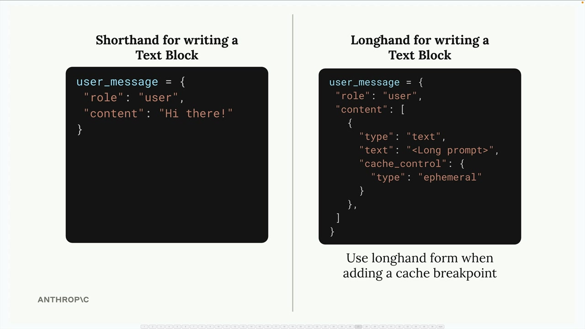
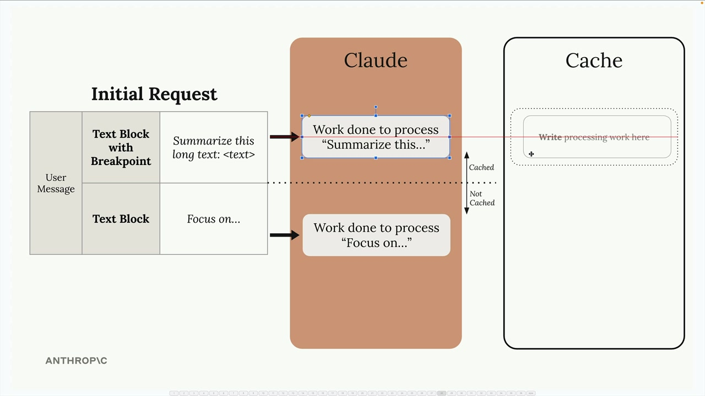
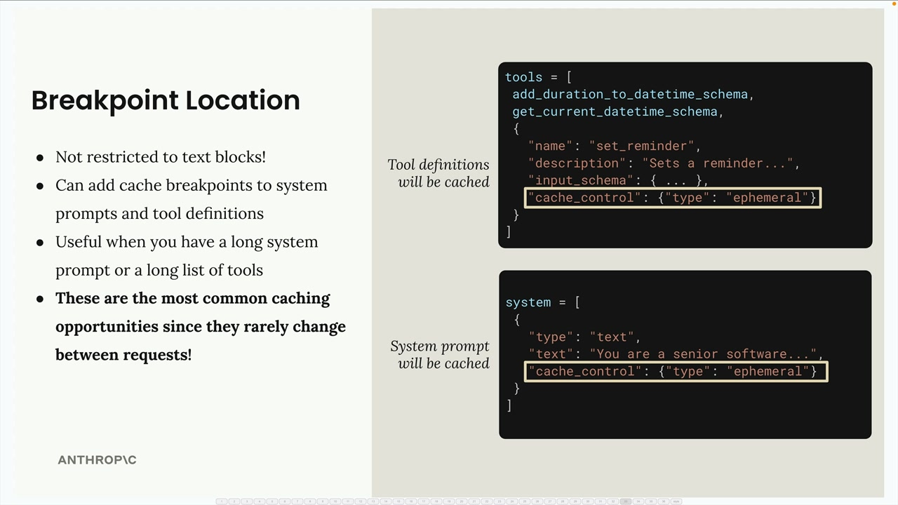
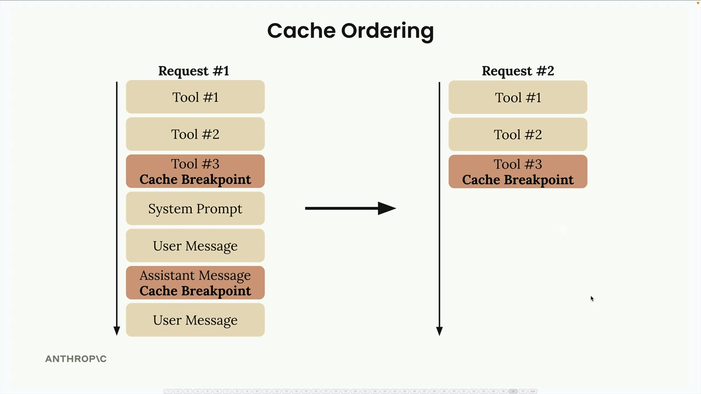

# 06f - 提示词缓存的规则

Claude 的缓存不是自动启用的，开发者需要手动将缓存断点（Cache Breakpoints）添加到消息中的特定块，具体地：

- 断点之前的所有工作结果将进行缓存，断点之后的内容将常规处理
- 在后续请求中，缓存仅对于断点及断点之前的内容相同的情况有效

## 如何使用

要添加缓存断点，需要使用文本块的完整形式：

```python
user_message = {
    "role": "user",
    # "content": "Hi there!", # 这是简写模式，无法添加缓存控制
    content: [
        {
            "type": "text",
            "text": "...",
            "cache_control": { # 缓存控制加在这里
                "type": "ephemeral"
            }
        }
    ]
}
```



为了使缓存在后续请求中生效，前缀内容必须与断点之前完全相同，任何一点小改动都会造成缓存失效。



## 缓存系统提示词和工具

缓存断点可以跨越多个消息和消息类型，包括但不限于系统提示词、工具定义、图像 Block、工具使用和工具结果 Block。系统提示词和工具定义是缓存的良好应用场景，因为它们在请求之间很少改变。



## 缓存顺序和最小内容长度

幕后，Claude 按照特定顺序处理您的请求组件：首先是工具，然后是系统提示，接着是消息。了解这个顺序有助于您有效地设置断点。您总共可以添加最多四个缓存断点。例如，您可能先缓存工具，然后在对话历史中的一部分添加另一个断点。这使您在请求的不同部分发生变化时，能够灵活地控制哪些内容被缓存。



缓存有一个最小阈值：内容长度至少为 1024 个 token 才能被缓存。这是所有要缓存的消息和块的总量，而不是单个块。

有效提示缓存的关键是识别你请求中哪些部分在多次调用中保持一致，并战略性地设置断点，以最大化重用同时最小化缓存失效。

