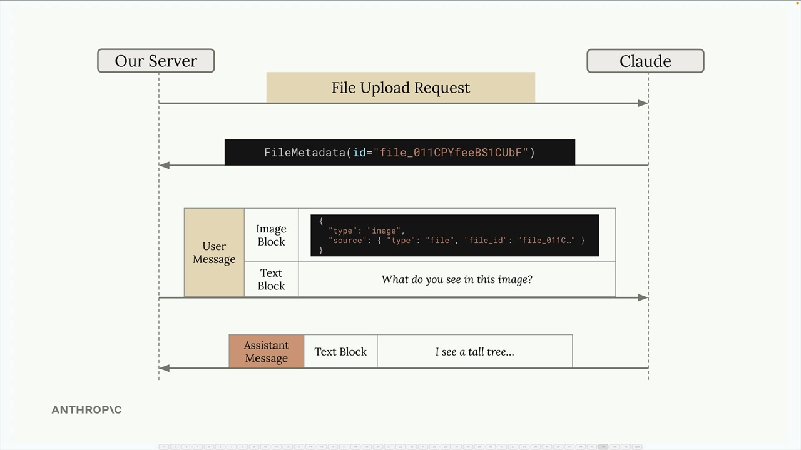
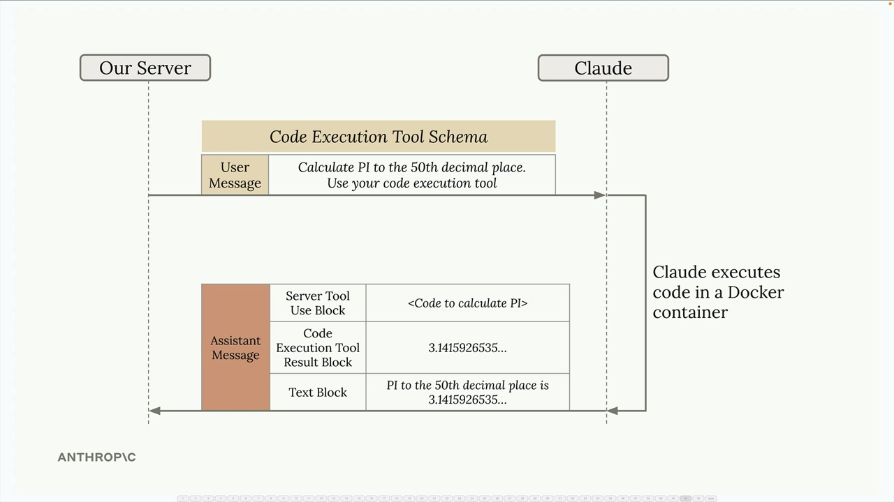
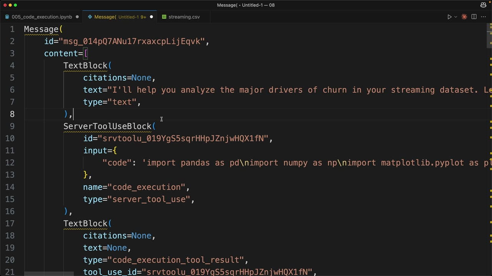

# 06h - 代码执行与文件 API

Anthropic API 提供了两个强大的、可协同的功能：文件 API 和代码执行。将它们结合使用以把复杂的任务委托给 Claude，创造了非常有趣的可能性。

## 文件 API

文件 API 提供了一种处理文件上传的替代方式。开发者不必直接在消息中携带图片或 PDF 的 Base64，而是可以提前上传文件，然后引用它们。



- 将文件（图像、PDF、文本等）通过单独的 API 调用上传到 Claude
- 接收一个包含文件 ID 的元数据对象
- 在后续的消息中引用该文件 ID，而不是使用原始文件数据

这种方法在需要多次引用同一文件，或处理较大文件时很有用。

## 代码执行工具

代码执行是一个基于服务器的工具。它不需要开发者提供实现，只需在请求中包含一个预定义的工具 Schema，Claude 就可以选择性地在一个隔离的 Docker 容器中执行 Python 代码。



- 在隔离的 Docker 容器中运行

- 无网络访问权限，无法进行外部 API 调用
- Claude 可以在一次对话中多次执行代码
- 结果由 Claude 捕获，以生成最终回复

## 组合文件 API 和代码执行工具

由于 Docker 容器没有网络访问权限，文件 API 是数据进出执行环境的主要方式。典型流程如下：

- 使用文件 API 上传数据文件，例如 CSV
- 在消息中包含一个容器上传块（Container Upload Block），并附上文件 ID
- 让 Claude 分析数据
- Claude 编写并执行代码来处理文件
- Claude 生成可以下载的输出（如图表）

## 实际例子

让我们以流媒体服务数据为例来看一个实际场景。CSV 文件存储用户信息，包括订阅等级、观看习惯以及他们是否已流失。

```python
# 首先使用辅助函数上传文件
file_metadata = upload('streaming.csv')
# 然后创建一个包含上传文件和分析请求的消息
messages = []
add_user_message(
    messages,
    [
        {
            "type": "text",
            "text": "进行详细的分析以确定客户流失的主要因素。你的最终输出应至少包含一个详细的图表来总结你的发现。"
        },
        {"type": "container_upload", "file_id": file_metadata.id},
    ],
)
# 带着代码实现工具，将消息发送给 Claude
chat(
    messages,
    tools=[{"type": "code_execution_20250522", "name": "code_execution"}]
)
```

## 理解响应

当 Claude 使用代码执行工具时，响应中将包含多种类型的块：

- 文本块：Claude 的分析和解释
- Server Tool Use 块：Claude 决定运行的代码
- 代码执行工具结果块：运行代码的输出



Claude 可能会在单个响应中多次执行代码，迭代地构建它的分析，每轮执行都包括代码及其运行结果。

## 下载产物

Claude 能够生成文件（如图表或报告）并提供下载。当 Claude 创建可视化内容时，会存储在容器中，开发者可以使用文件 API 下载它。响应中带有 `type: "code_execution_output"` 的代码块就包含了生成内容的文件 ID：

```python
download_file("file_id_from_response")
```

## 更多用途

组合文件 API 和代码执行工具进行数据分析是自然的。这种结合也开辟了更多可能性，如：

- 图像处理、操作
- 文档解析、转换
- 数学计算、建模
- 使用自定义格式生成报告

关键在于将复杂的计算任务委托给 Claude，同时通过文件 API 保持对输入和输出的控制，使得 Claude 成为你的编程助手，能够实际执行和迭代解决方案。
