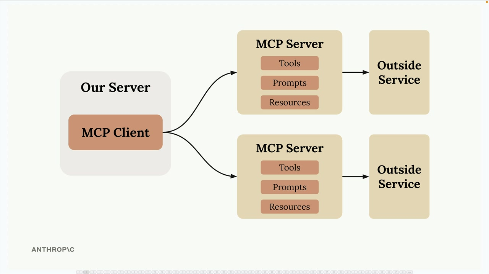
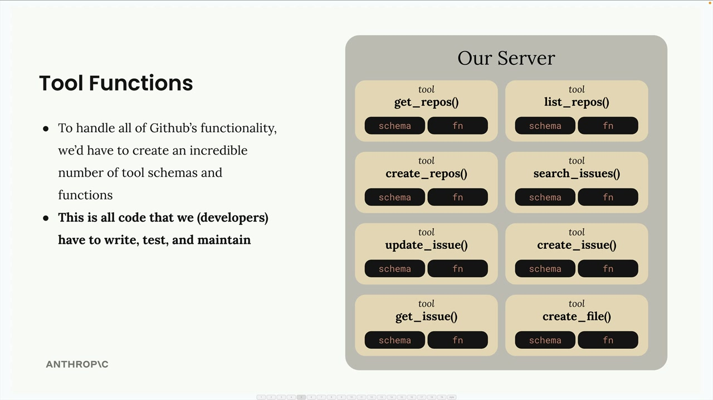
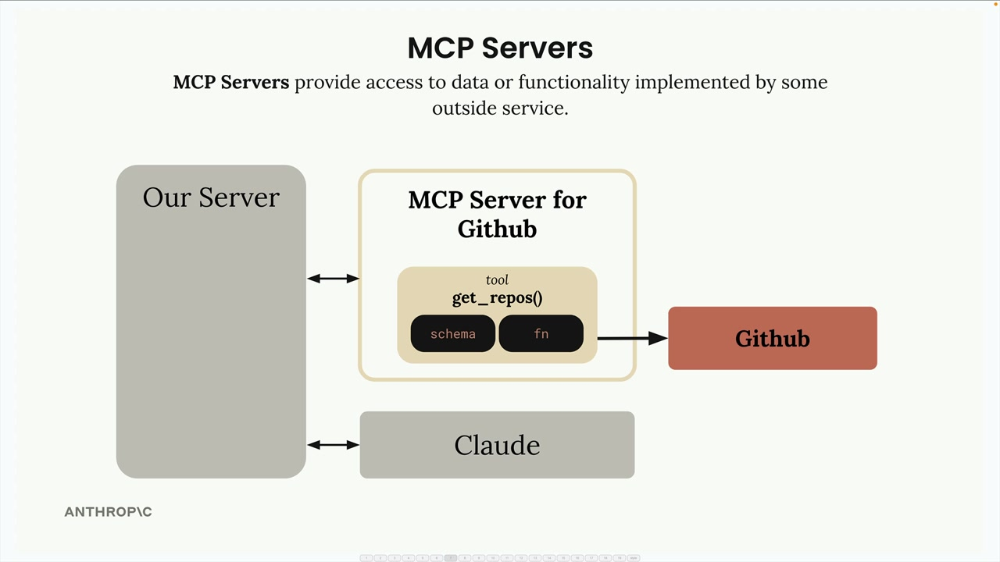

# 07a - 模型上下文协议介绍

模型上下文协议（MCP）是一个为 Claude 提供上下文和工具的通信层，而无需编写大量繁琐的集成代码。可以将它视为一种将工具定义和执行的负担从你的服务器转移到专门的 MCP 服务器的方式。

MCP 基本架构如图所示。一个 MCP 客户端（例如你的服务器）连接到包含工具、提示词和资源的一系列 MCP 服务器，每个 MCP 服务器也都是与某个外部服务的接口。

## 一个例子

假设我们正在构建一个应用，用户可以基于他们的 GitHub 数据提问，如“我的所有 Repo 中有什么 Open 的 Pull Request？”为了回答这个问题，Claude 需要工具来访问 GitHub API。如果没有 MCP，开发者需要自行创建所有与 GitHub 进行集成的工具，为每一个想支持的 GitHub 功能编写 Schema 和工具函数。这意味着大量的代码，以及编写之后的测试和维护工作。

MCP 将工具定义和执行的负担从你的服务器转移到 MCP 服务器。开发者不再需要编写所有的 GitHub 工具，而是由专门的 MCP 服务器提供方进行编写和执行，以访问外部服务的数据或功能。MCP 服务器将复杂的集成工作打包成可重用的构件，任何遵循 MCP 协议的客户端应用都可以连接。

## 常见问题

### 谁编写 MCP 服务器？

任何人都可以创建一个 MCP 服务器实现。通常，外部服务提供方会制作官方的 MCP 实现。例如，AWS 可能会发布一个带有各种服务器运维工具的官方 MCP 服务器。

### MCP 与直接调用 API 有何不同？

MCP 服务器提供预定义的工具 Schema 和函数，节省了直接调用 API 时需要自行编写、实现工具的工作量。

### MCP 不就是一般的 Tool Use 吗？

这是一种常见的误解，MCP 服务器和 Tool Use 是互补但不同的概念。MCP 解决的是谁负责创建和维护工具的问题。使用 MCP 时，其他人已经编写好了现成的工具函数和 Schema 打包在 MCP 服务器中对外提供，无需开发者自己构建和维护复杂的集成工作。

