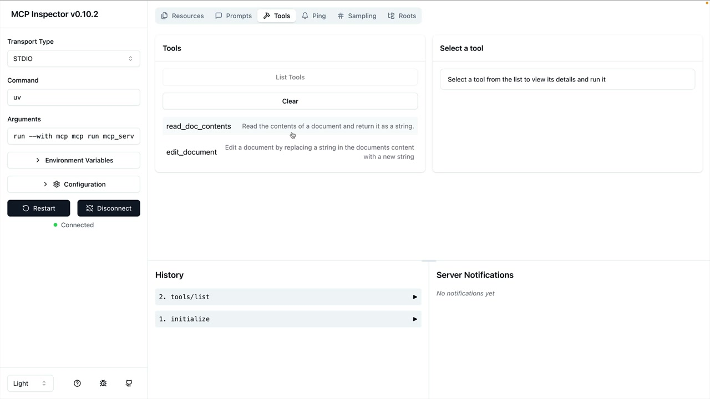
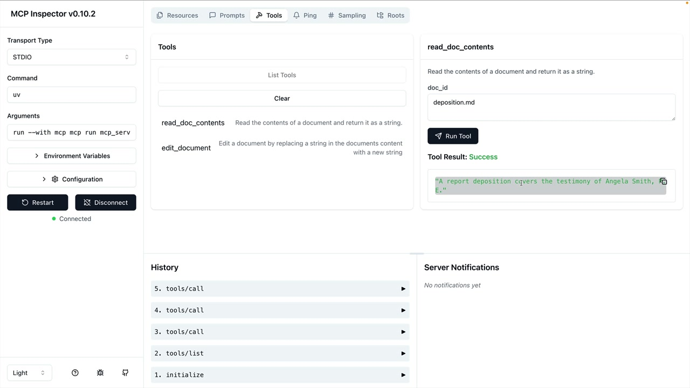

# 07e - MCP Inspector

在构建 MCP 服务器时，开发者需要一种方法来在调试和测试其功能。Python MCP SDK 内置一个基于浏览器的 Inspector，允许你实时调试和测试你的服务器。

## 启动 Inspector

使用以下命令运行 Inspector：

```
mcp dev mcp_server.py
```

这将在端口 6277 上启动一个 DevServer，并提供一个本地 URL 供你打开，访问到 Dashboard。


MCP Inspector 正在持续迭代，因此你看到的界面可能截图有所不同，不过用于测试工具、资源和提示词的核心功能应该是相似的。

## 连接和测试工具

点击左侧的“连接”按钮可以启动你的 MCP 服务器，连接后将看到一个包含资源、提示词、工具和其他功能的导航栏。如果要测试工具：

- 导航至工具 Tab
- 点击“列出工具”查看所有可用工具
- 选择一个工具，打开其测试界面
- 填写所需参数
- 点击“运行工具”来执行并查看结果



例如，要调用文档阅读工具，则输入一个文档 ID（如 `deposition.md`），然后运行该工具，Inspector 会显示返回的内容。



## 开发工作流程

Inspector 使得我们的开发流程变得高效：

- 修改你的 MCP 服务器代码
- 通过 Inspector 测试单个工具
- 无需完整的应用即可验证结果
- 可在隔离的环境中调试问题

Inspector 使我们不需要将 MCP 服务器连接到 Claude 或其他应用程序，就能测试基本功能，使开发更快、更专注。
