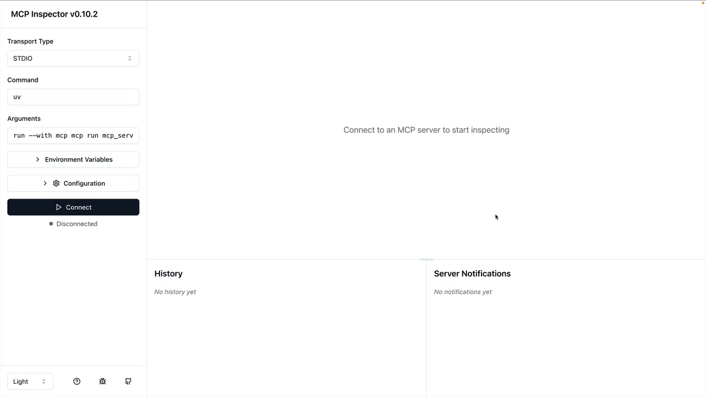

# 07e - MCP Inspector

在构建 MCP 服务器时，你需要一种方法来在不连接完整应用程序的情况下测试你的功能。Python MCP SDK 包含一个内置的基于浏览器的检查器，允许你在实时环境中调试和测试你的服务器。

## 启动检查器

首先，确保您的 Python 环境已激活（查看您的项目 README 以获取确切命令）。然后使用以下命令运行检查器：

```
mcp dev mcp_server.py
```

这将在端口 6277 上启动一个开发服务器，并提供一个本地 URL 供您在浏览器中打开。检查器界面将加载，显示 MCP 检查器仪表板。



MCP 检查器正在积极开发中，因此您看到的界面可能与当前截图有所不同。但是，用于测试工具、资源和提示的核心功能应该保持相似。

## 连接与测试工具

点击左侧的"连接"按钮以启动您的 MCP 服务器。连接后，您将看到一个包含资源、提示、工具和其他功能的导航栏。

要测试您的工具：

- 导航至工具部分
- 点击"列出工具"查看所有可用工具
- 选择一个工具打开其测试界面
- 填写所需参数
- 点击"运行工具"来执行并查看结果


## 测试文档操作

例如，要测试一个文档阅读工具，你需要输入一个文档 ID（如"deposition.md"），然后运行该工具。检查器会显示结果，包括返回的内容或成功消息。


您可以串联操作以验证功能。例如，在通过替换文本编辑文档后，您可以立即再次运行读取工具以确认更改是否已正确应用。

## 开发工作流程

检查器创建了一个高效的开发循环：

- 修改您的 MCP 服务器代码
- 通过检查器测试单个工具
- 无需完整应用设置即可验证结果
- 隔离环境中调试问题

随着你构建更复杂的 MCP 服务器，这个工具变得至关重要。它消除了将服务器连接到 Claude 或其他应用程序以测试基本功能的需要，使开发更快、更专注。
