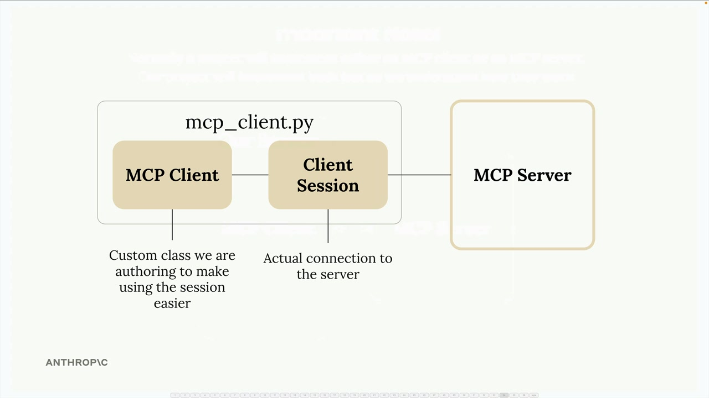
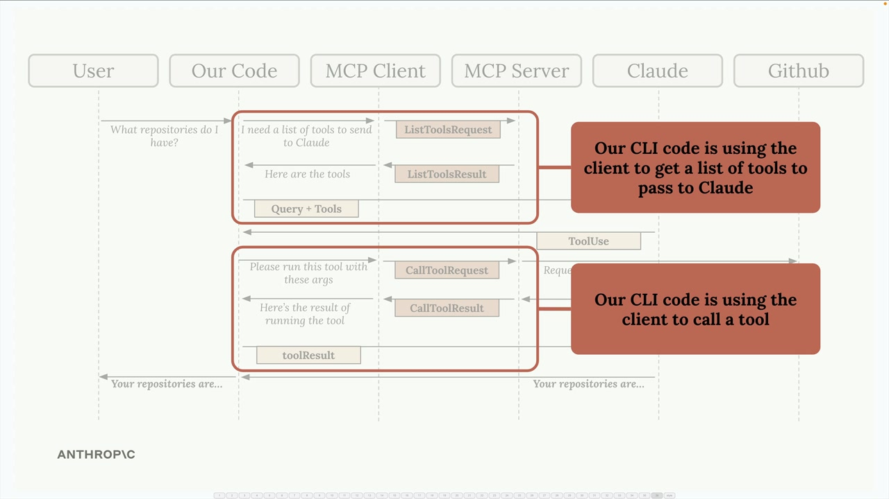

# 07f - 实现 MCP 客户端

现在我们的 MCP 服务器已经可以运行了，接下来该构建客户端了。客户端是允许我们的应用程序与 MCP 服务器通信并访问其功能的关键。

## 理解客户端架构

在大多数实际项目中，你只需要实现 MCP 客户端或 MCP 服务器中的一个，而不是两个。在这个项目中我们同时构建它们，这样你就能看到它们是如何协同工作的。

MCP 客户端由两个主要组件组成：

- MCP 客户端 - 我们创建的自定义类，用于简化会话的使用
- 客户端会话 - 实际连接到服务器的连接（MCP Python SDK 的一部分）



当我们使用完客户端会话时，需要正确清理资源。这就是为什么我们将其包装在我们的自定义 MCP 客户端类中——以自动处理所有清理工作。

## 客户端如何融入我们的应用程序

还记得我们的应用流程吗？我们的 CLI 代码需要通过 MCP 服务器完成两件主要的事情：

- 获取可发送给 Claude 的工具列表
- 当 Claude 请求时执行工具



MCP 客户端通过简单的调用方法提供这些功能，我们的应用程序代码可以使用这些方法。

## 实现核心方法

我们需要在我们的客户端实现两个关键方法： `list_tools()` 和 `call_tool()` 。

### List Tools

这个方法从服务器获取所有可用的工具：

```python
async def list_tools(self) -> list[types.Tool]:
    result = await self.session().list_tools()
    return result.tools
```

它很简单——我们访问我们的会话（与服务器连接），调用内置的 `list_tools()` 函数，并从结果中返回工具。

### Call Tool

此方法在服务器上执行特定工具：

```python
async def call_tool(
    self, tool_name: str, tool_input: dict
) -> types.CallToolResult | None:
    return await self.session().call_tool(tool_name, tool_input)
```

我们将工具名称和输入参数（由 Claude 提供）传递给服务器，并返回结果。

## 测试客户端

要测试我们的实现，可以直接运行客户端。该文件包含一个测试框架，它连接到我们的 MCP 服务器并调用我们的方法：

```python
async with MCPClient(
    command="uv", args=["run", "mcp_server.py"]
) as client:
    result = await client.list_tools()
    print(result)
```

运行这个测试时，我们应该看到我们打印的工具定义，包括我们之前创建的 `read_doc_contents` 和 `edit_document` 工具。

## 整合所有内容

现在我们的客户端可以列出工具并调用它们，我们可以测试完整流程。当运行我们的主应用程序并询问 Claude 关于一个文档时：

- 我们的代码使用客户端来获取可用工具
- 这些工具连同用户的问题一起发送给 Claude
- Claude 决定使用 `read_doc_contents` 工具
- 我们的代码使用客户端来执行该工具
- 结果被发送回给 Claude，然后 Claude 回复用户

例如，询问"报告.pdf 文档的内容是什么？"将触发 Claude 使用我们的文档阅读工具，我们就会得到关于我们在服务器上设置的 20 米冷凝塔文档的信息。

客户端充当了我们的应用逻辑与 MCP 服务器之间的桥梁，使得访问服务器功能变得容易，而无需担心底层的连接细节。
