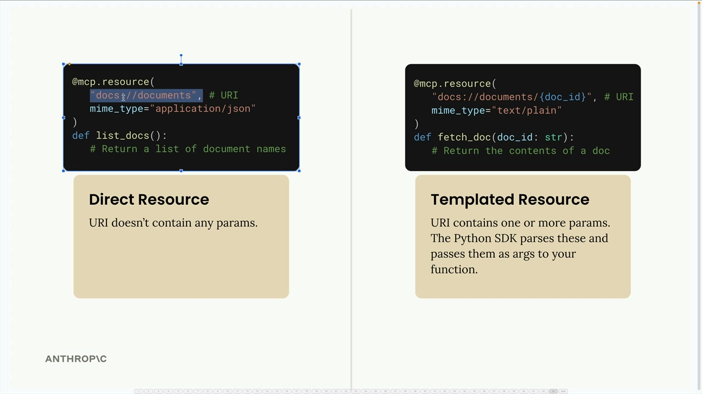
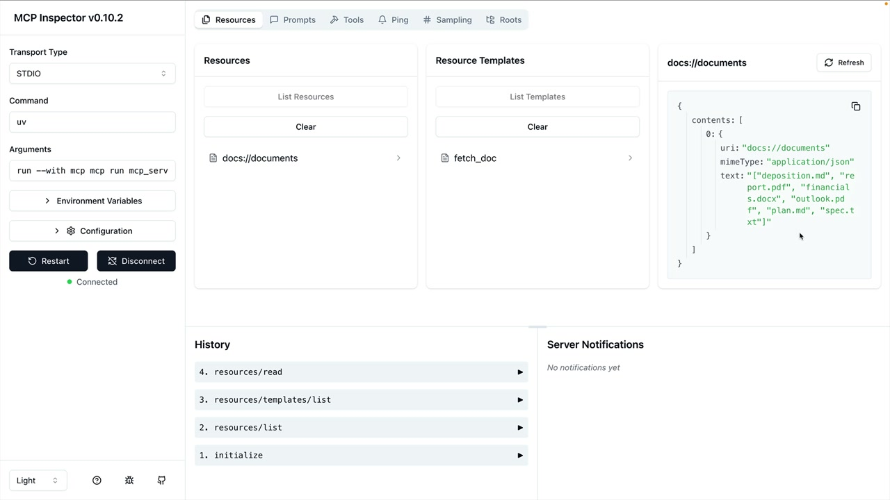

# 07g - 定义资源

MCP 服务器中的资源（Resources）让你可以向 MCP 客户端展示数据（就像 HTTP 服务器中的 GET 请求处理器）。这适用于需要获取信息而不是执行操作的场景。

## 一个例子

假设你想做一个文档 Mention 功能，用户可以输入 `@document_name` 来引用文件，这需要实现：

- 获取所有可用文档的列表，用于自动补全时的展示
- 获取特定文档的内容，用于被提及时注入相应文本到提示词


## 资源的原理

资源遵循请求-响应模式，MCP 客户端发送 `ReadResourceRequest` 和 URI，MCP 服务器响应数据。目前，存在种类型的资源：

- 直接资源：URI 是静态不变的，如 `docs://documents`
- 模板化资源：带参数的 URI，如 `docs://documents/{doc_id}`，Python SDK 会解析参数并将其作为 kwargs 传递

## 实现资源

资源使用 `@mcp.resource()` 装饰器进行定义，以下是创建两种类型的资源的方法：



### 直接资源（列出所有文档）

```python
@mcp.resource(
    "docs://documents",
    mime_type="application/json"
)
def list_docs() -> list[str]:
    return list(docs.keys())
```

### 模板资源（获取文档内容）

```python
@mcp.resource(
    "docs://documents/{doc_id}",
    mime_type="text/plain"
)
def fetch_doc(doc_id: str) -> str:
    if doc_id not in docs:
        raise ValueError(f"Doc with id {doc_id} not found")
    return docs[doc_id]
```

## MIME Types

资源可以返回任何类型的数据——字符串、JSON、二进制等，因此需要 `mime_type` 参数为 MCP 客户端提供返回数据类型的提示，如：

- `application/json`：结构化 JSON 数据
- `text/plain`：纯文本内容
- 其他任何有效的 MIME Types

对于 JSON，MCP Python SDK 会自动序列化你实现的函数的返回值，无需手动转换为 JSON 字符串。

## 测试资源

可以使用 MCP Inspector 测试资源：

```shell
uv run mcp dev mcp_server.py
```

你会在 Inspector 中看到：

- 资源：列出直接资源
- 资源模板：列出接受参数的模板化资源

点击资源可以测试，查看 MCP 客户端将收到的响应。



## 要点

- 资源暴露数据，工具执行操作
- 直接资源用于静态数据，模板化资源处理参数化查询
- MIME Types 帮助 MCP 客户端理解响应格式
- SDK 自动处理序列化
- 模板 URI 中的参数变为 kwargs 传递给函数

资源提供了一种将数据暴露给 MCP 客户端的优雅方式，适合于文档 Mention、文件浏览或其他需要从 MCP 服务器获取信息的场景。
