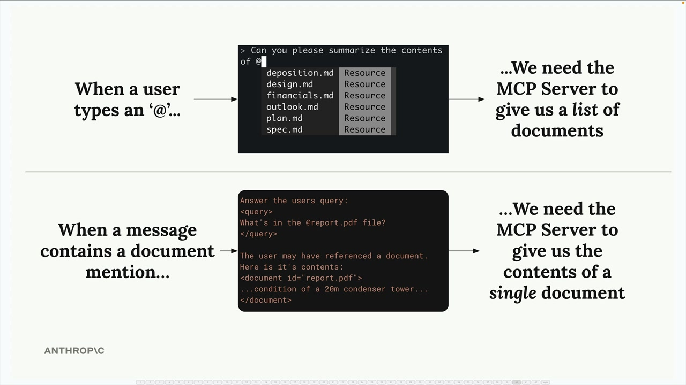

# 07g - 定义资源

MCP 服务器中的资源允许你向客户端展示数据，类似于典型 HTTP 服务器中的 GET 请求处理器。它们非常适合需要获取信息而不是执行操作的场景。

## 通过示例理解资源

假设你想构建一个文档提及功能，用户可以输入 `@document_name` 来引用文件。这需要两个操作：

- 获取所有可用文档的列表（用于自动补全）
- 获取特定文档的内容（当提及时）



当用户输入 `@` 时，你需要显示可用的文档。当他们提交带有提及的消息时，你会自动将该文档的内容注入发送给 Claude 的提示中。

## 资源如何工作

资源遵循请求-响应模式。您的客户端发送一个 `ReadResourceRequest` 和 URI，MCP 服务器响应数据。URI 类似于您想要访问的资源的地址。

存在两种类型的资源：

- 直接资源：不变的静态 URI，如 `docs://documents`
- 模板化资源：带参数的 URI，如 `docs://documents/{doc_id}`

对于模板资源，Python SDK 会自动从 URI 中解析参数，并将它们作为关键字参数传递给您的函数。

## 实现资源


资源使用 `@mcp.resource()` 装饰器进行定义。以下是创建两种类型的方法：

### 直接资源（列出文档）

```python
@mcp.resource(
    "docs://documents",
    mime_type="application/json"
)
def list_docs() -> list[str]:
    return list(docs.keys())
```

### 模板资源（获取文档）

```python
@mcp.resource(
    "docs://documents/{doc_id}",
    mime_type="text/plain"
)
def fetch_doc(doc_id: str) -> str:
    if doc_id not in docs:
        raise ValueError(f"Doc with id {doc_id} not found")
    return docs[doc_id]
```

## MIME 类型

资源可以返回任何类型的数据——字符串、JSON、二进制等。 `mime_type` 参数为客户提供关于返回数据类型的提示：

- `application/json` - 结构化 JSON 数据
- `text/plain` - 纯文本内容
- 其他任何有效的 MIME 类型，用于不同的数据格式

MCP Python SDK 会自动序列化你的返回值。你无需手动转换为 JSON 字符串。

## 测试资源

您可以使用 MCP Inspector 测试您的资源。通过以下方式运行您的服务器：

```
uv run mcp dev mcp_server.py
```

然后连接到浏览器中的检查器。你会看到：

- 资源：列出您的直接/静态资源
- 资源模板：显示接受参数的模板资源

点击任何资源进行测试，查看客户端将收到的确切响应结构。


## 要点

- 资源暴露数据，工具执行操作
- 使用直接资源处理静态数据，使用模板资源处理参数化查询
- MIME 类型帮助客户端理解响应格式
- SDK 自动处理序列化
- 模板 URI 中的参数名称成为函数参数

资源提供了一种干净的方式，使数据能够提供给 MCP 客户端，支持文档提及、文件浏览或任何需要从服务器获取信息的场景。
