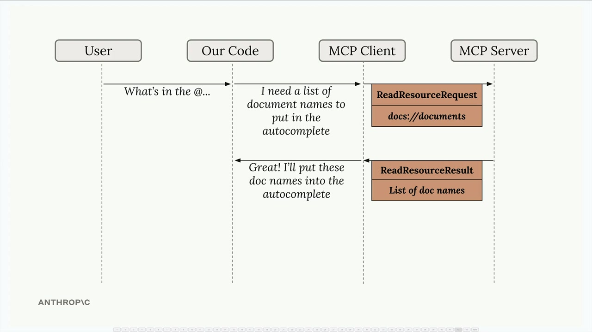

# 07h - 访问资源

资源允许你的服务器直接获取需要在提示词中展示的数据，无需通过工具调用来获取信息，这创造了一种更高效的提供上下文的方式。

## 理解资源请求

当在 MCP 服务器上定义了资源后，你的应用需要一个方法来请求和使用它们（比如将其内容包含在发送给 Claude 的提示词中），MCP 客户端则充当应用和 MCP 服务器之间的桥梁，协助从服务器获取资源，自动处理通信和数据解析。



## 实现资源读取

核心是在 MCP 客户端中实现一个 `read_resource` 函数，其接受一个 URI 参数，用于标识要获取的资源：

```python
import json
from pydantic import AnyUrl # 用于确保 URI 参数的类型处理正确

async def read_resource(self, uri: str) -> Any:
    result = await self.session().read_resource(AnyUrl(uri))
    # MCP 服务器的响应包含一个 contents 列表
    resource = result.contents[0] # 通常只需要第一个元素包含实际资源内容以及 MIME Types 等元数据
```

## 处理不同内容类型

资源可以返回不同类型的内容，因此 MCP 客户端需要根据 MIME Types 适当地解析它们：

```python
if isinstance(resource, types.TextResourceContents):
    # JSON 资源被正确解析为 Python 对象，而纯文本资源则作为字符串返回
    if resource.mimeType == "application/json":
        return json.loads(resource.text)

    return resource.text
```

## 测试资源

可以通过 MCP Inspector 测试该功能：


当您输入类似"What's in the @report.pdf document?"的内容时，系统应该：

- 在自动完成列表中显示可用资源
- 允许您选择一个资源
- 自动获取资源内容
- 将内容包含在提示中发送给 Claude

主要优势在于 Claude 可以直接在提示中接收文档内容，无需调用工具来获取信息。这使得交互更加快速高效。

## 与您的应用程序集成

要记住，你编写的 MCP 客户端代码会被应用程序的其他部分使用。 `read_resource` 函数成为其他组件可以调用来获取文档内容、列出可用资源或把资源数据集成到提示中的构建模块。

这种关注点分离使你的代码保持清晰：MCP 客户端处理与服务器端的通信，而你的应用逻辑则专注于如何有效使用这些数据。
