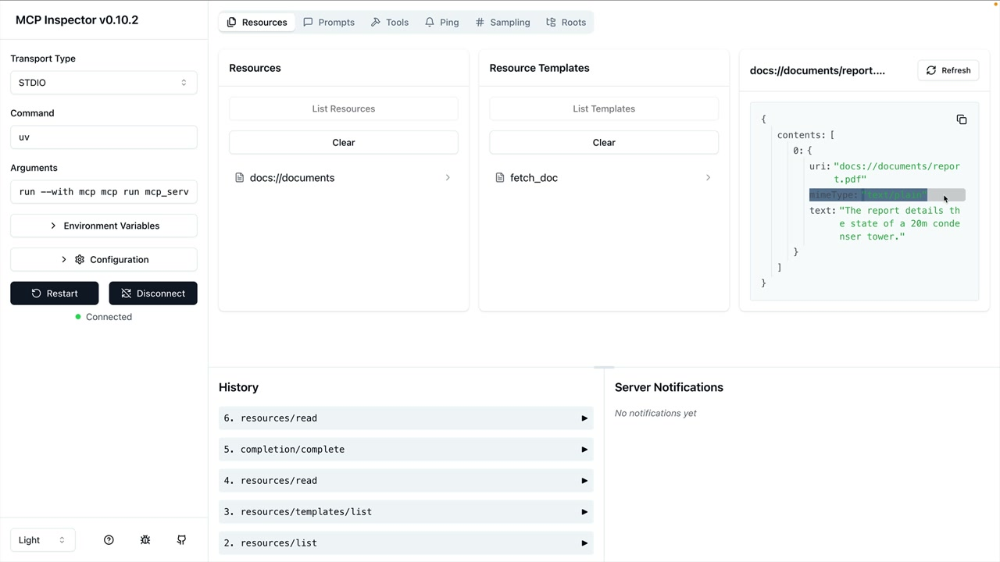

# 07h - 访问资源

MCP 中的资源允许您的服务器直接在提示中展示数据，而无需通过工具调用来访问信息。这为向 Claude 等 AI 模型提供上下文创造了一种更高效的方式。

## 理解资源请求

当您在 MCP 服务器上定义了资源后，您的客户端需要一个方法来请求和使用它们。客户端充当您的应用程序和 MCP 服务器之间的桥梁，自动处理通信和数据解析。

流程很简单：当用户想要引用一个文档（比如输入"@report.pdf"）时，您的应用程序使用 MCP 客户端从服务器获取该资源，并将其内容直接包含在发送给 Claude 的提示中。


## 实现资源读取

核心功能需要您在 MCP 客户端中实现一个 `read_resource` 函数。该函数接受一个 URI 参数，用于标识要获取的资源：

```python
async def read_resource(self, uri: str) -> Any:
    result = await self.session().read_resource(AnyUrl(uri))
    resource = result.contents[0]
```

MCP 服务器的响应包含一个 `contents` 列表。通常只需要第一个元素，它包含实际资源数据以及 MIME 类型等元数据。

## 处理不同内容类型

资源可以返回不同类型的内容，因此您的客户端需要适当地解析它们。MIME 类型告诉您如何处理数据：

```python
if isinstance(resource, types.TextResourceContents):
    if resource.mimeType == "application/json":
        return json.loads(resource.text)
    
    return resource.text
```

这种做法确保 JSON 资源被正确解析为 Python 对象，而纯文本资源则作为字符串返回。MIME 类型充当你的提示，用于确定正确的解析策略。

## 必需的导入

为了让这个功能正常工作，你需要在你的 MCP 客户端中导入这些内容：

```python
import json
from pydantic import AnyUrl
```

`json` 模块处理解析 JSON 响应，而 `AnyUrl` 确保 URI 参数的类型处理正确。

## 测试资源访问

一旦实施，您可以通过 CLI 应用程序测试该功能。当您输入类似"What's in the @report.pdf document?"的内容时，系统应该：

- 在自动完成列表中显示可用资源
- 允许您选择一个资源
- 自动获取资源内容
- 将内容包含在提示中发送给 Claude



主要优势在于 Claude 可以直接在提示中接收文档内容，无需调用工具来获取信息。这使得交互更加快速高效。

## 与您的应用程序集成

要记住，你编写的 MCP 客户端代码会被应用程序的其他部分使用。 `read_resource` 函数成为其他组件可以调用来获取文档内容、列出可用资源或把资源数据集成到提示中的构建模块。

这种关注点分离使你的代码保持清晰：MCP 客户端处理与服务器端的通信，而你的应用逻辑则专注于如何有效使用这些数据。
