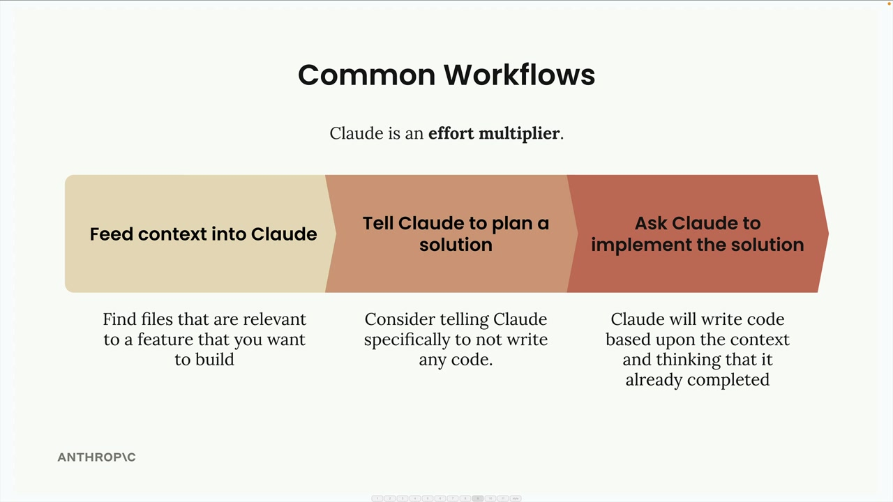

# 08c - Claude Code 实践

Claude Code 不仅是一个编写代码的工具，更旨在贯穿软件项目的每个阶段，与开发者协同工作。把它想象成你团队中的另一位工程师，能够处理从 Setup 到部署，再到技术支持的全流程工作。

## `/init` 指令

当你在一个项目中开始使用 Claude Code 时，首先运行 `/init` 命令，告诉 Claude 扫描整个代码库，理解项目结构、依赖关系、编码风格和架构。Claude 会将其所学的一切总结在名为 `CLAUDE.md` 的特殊文件中，后续该文件会自动作为上下文包含在未来所有对话中，使 Claude 记住项目的要点。

你可以在不同维度拥有多个 CLAUDE.md 文件：

- 项目：在所有参与该项目的工程师间共享
- 本地：个人的笔记，不提交到 Git
- 用户：在你的所有项目中使用

可以使用 `#` 命令快速为 CLAUDE.md 文件添加笔记。例如，输入

```
# Always use descriptive variable names
```

以将该要求添加到项目、本地或用户级别的记忆中。

## 常见流程

Claude Code 像一种“效率倍增器”。你提供的上下文和结构信息越多，结果就越好。以下是一种高效的流程：



### 步骤 1：将上下文输入 Claude

在让 Claude 构建某功能之前，找出代码库中与该功能相关的文件，让 Claude 先阅读和分析它们。这为 Claude 提供了你的代码结构以及现有功能的示例，帮助它在此基础上继续构建。

### 步骤 2：让 Claude 规划解决方案

不要直接就开始实现，而是先让 Claude 思考问题并创建一个计划。明确告诉 Claude 现在不要写任何代码，只需专注于考虑所需的方法和步骤。

### 步骤 3：让 Claude 实现解决方案

当有一个周密的计划后，让 Claude 来实施它。Claude 将根据背景知识和已经共同完成的规划来编写代码。

## 测试驱动开发（TDD）

为了获得更好的效果，可以使用测试驱动的方法：

- 将上下文输入 Claude：与之前相同，让 Claude 阅读相关文件
- 让 Claude 思考测试用例：头脑风暴哪些测试可以验证新功能
- 让 Claude 实现这些测试：选择最相关的测试，让 Claude 编写这些用例
- 让 Claude 编写能通过测试的代码：Claude 将迭代实现，直到所有测试都通过

这种方法有助于生成更健壮的代码。

## 一个例子

假设你想在现有项目中添加一个文档转换工具：

```
// 首先，让 Claude 读取相关文件
> 阅读 math.py 和 document.py 文件

// 然后，要求进行规划（不是实现）
> 计划实现 document_path_to_markdown 工具：
1. 创建一个函数，该函数：
- 接收一个文件路径参数
- 验证文件是否存在
- 根据扩展名确定文件类型
- 从文件中读取二进制数据
- 利用现有的 binary_document_to_markdown 函数
- 返回 Markdown 字符串
2. 添加适当的文档
3. 将工具注册到 MCP 服务器
4. 添加测试

// 最后，要求实现
> 实现这个计划
```

Claude 将创建该函数、更新必要的文件、编写测试、运行 Test Suite 来验证一切是否正常工作。

## 常用命令

- `/clear`：清除对话历史并重置上下文
- `/init`：扫描代码库并创建 CLAUDE.md
- `#`：向 CLAUDE.md 添加笔记

使用 Claude Code 的关键在于把它当作协作伙伴，而不仅仅是代码生成器。你提供的上下文和结构信息越多，Claude 就能越有效地帮助你构建和维护项目。
