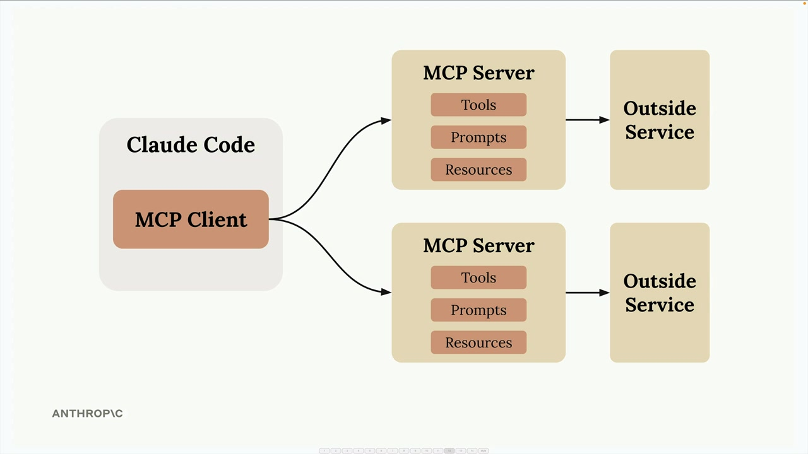
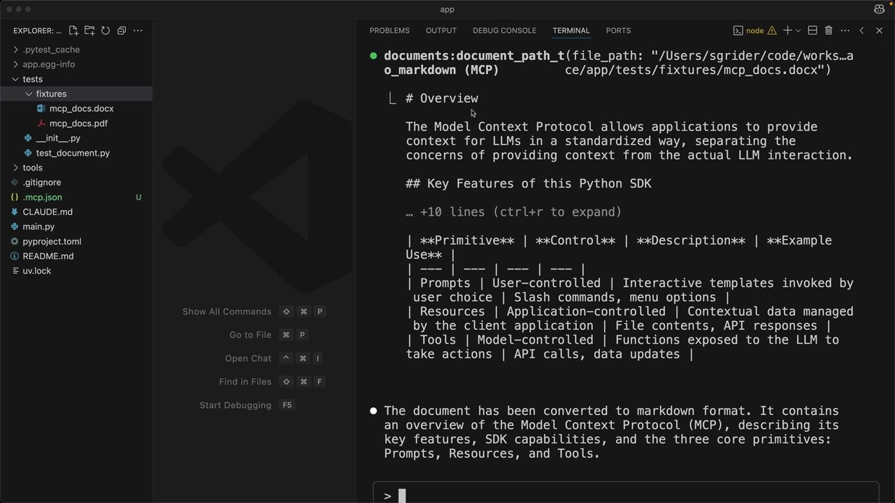

# 08d - Claude Code 与 MCP

Claude Code 内置了 MCP 客户端，这意味着你可以连接 MCP 服务器来大幅扩展 Claude 的功能。

## MCP 如何扩展 Claude



每个 MCP 服务器可以通过三个主要组件向 Claude 暴露不同类型的功能：工具（用于执行操作）、提示（用于模板）和资源（用于访问数据）。

## 设置 MCP 服务器

使用命令行来注册您的服务器：

```python
claude mcp add [server-name] [command-to-start-server]
claude mcp add documents uv run main.py
```

注册后，Claude Code 在启动时会自动连接到您的服务器。

## 一个例子

一个实际例子是创建一个工具，让 Claude 能够读取 PDF 和 Word 文档。通过构建一个具有"document_path_to_markdown"工具的 MCP 服务器，你可以让 Claude 将文档内容转换为 markdown 格式。

当你要求 Claude 将"tests/fixtures/mcp_docs.docx"文件转换为 markdown 格式时，它会自动使用你的自定义工具来读取该文档并返回转换后的内容。



## 流行的 MCP

MCP 生态系统包括许多常见开发工具和服务的服务器：

- sentry-mcp - 自动发现并修复 Sentry 中记录的错误
- playwright-mcp - 为测试和故障排除提供 Claude 浏览器自动化功能

- figma-context-mcp - 将 Figma 设计暴露给 Claude
- mcp-atlassian - 允许 Claude 访问 Confluence 和 Jira
- firecrawl-mcp-server - 为 Claude 添加网络抓取功能
- slack-mcp - 允许 Claude 发布消息或回复特定线程

真正的强大来自于结合多个符合您特定开发流程的 MCP 服务器。您可以设置：

- 一个 Sentry 服务器来获取生产错误详情
- 一个 Jira 服务器用于读取工单需求
- 一个 Slack 服务器用于在完成工作时通知您的团队
- 用于您内部工具和 API 的自定义服务器

这创建了一个开发环境，让 Claude 可以无缝地与您已经使用的所有工具和服务协同工作，使其成为一个更强大的编码助手，专门针对您的特定工作流程进行定制。
