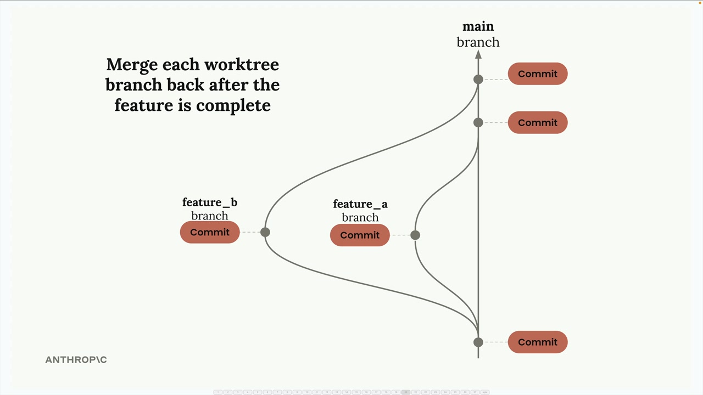
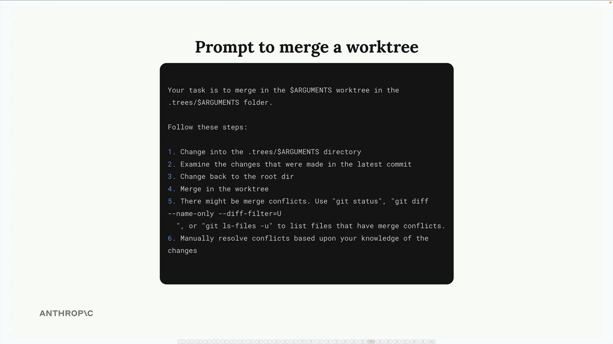

# 08e - Claude Code 并行

并行运行多个 Claude Code 实例是你能够获得的最大生产力提升之一。由于 Claude 非常轻量级，你可以轻松地启动多个副本，为每个副本分配不同的任务，并让它们同时工作。这实际上为你提供了一个由虚拟软件工程师组成的项目团队。

## 核心挑战

并行实例的主要问题是文件冲突。当两个 Claude 实例同时尝试修改同一个文件时，由于它们彼此不了解对方的修改，可能会写入冲突或无效的代码。

解决方案很简单：给每个实例分配一个独立的工 作空间。每个 Claude 实例都使用自己项目的副本进行工作，在隔离状态下进行修改，然后将这些修改合并回主项目。

## Git Worktrees

Git 工作树是这个工作流程的完美工具。_Git_ 的 worktree 机制允许在同一个仓库中同时检出多个分支。每个工作树对应一个单独的分支。Separate Claude Code 实例在每个分支。当每个 Claude 实例完成工作后，你提交更改并将它们合并回你的主分支，就像任何正常的 Git 工作流程一样。

与其手动创建工作树，你可以让 Claude 处理整个流程。这是一个创建工作树并设置工作区的提示：

这个提示告诉 Claude：

- 检查是否已存在工作树
- 在 `.trees` 文件夹中创建新的 Git 工作树
- 将 `.venv` 文件夹创建为符号链接（因为虚拟环境不被 Git 跟踪）
- 在该目录中启动新的 VSCode 实例

## 自定义斜杠命令

反复输入长提示会很繁琐。Claude Code 支持自定义命令，可自动执行此过程。

- 在 `.claude/commands` 中添加一个 `.md` 文件
- 将你的提示语放在文件中
- 使用 `$ARGUMENTS` 作为动态值的占位符
- 使用 `/project:filename argument` 运行

## 并行开发工作流

这里是一个典型的并行开发会话的工作方式：

- 为不同功能创建多个工作树
- 在每个工作空间中启动 Claude 代码
- 为每个实例分配不同的任务
- 让他们并行工作
- 当每个任务完成时提交更改
- 将所有分支合并回主分支

您也可以使用另一个自定义命令来自动化合并过程。创建一个合并提示，该提示应：

- 切换到工作树目录
- 检查最新提交
- 切换回根目录
- 合并工作树分支
- 自动处理任何合并冲突
- 根据对变更的理解解决冲突

Claude 甚至能够智能处理合并冲突，理解来自不同分支的变更上下文，并适当地解决它们。

## 扩展您的开发

这种方法的扩展性取决于你能有效管理的并行实例数量。你受到的限制只有：

- 你机器的资源配置
- 您协调多项任务的能力
- 潜在合并冲突的复杂性

生产力的提升非常显著——你不再需要按顺序开发功能，而是可以同时开发多个功能，从而大幅缩短复杂项目的开发时间。
