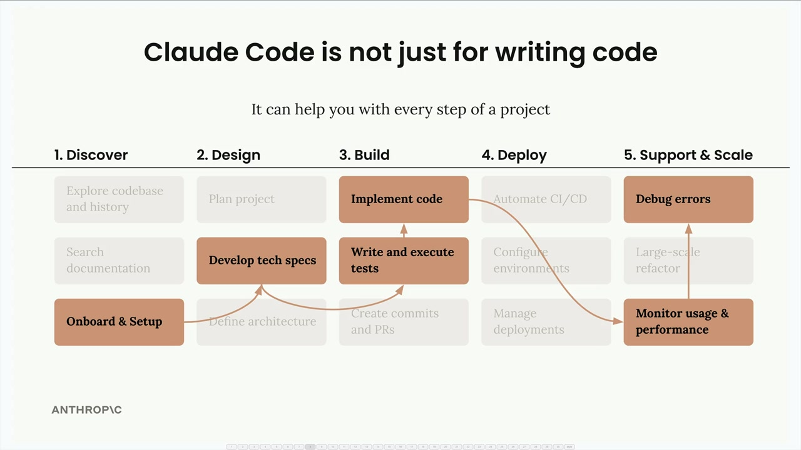

# 08f - Computer Use 自动调试

Claude Code 远不止在编辑器中编写代码。它可以监控您已部署的应用程序，检测生产环境中的错误，甚至自动修复它们。这创建了一个强大的工作流程，Claude 充当您的自动化调试助手，捕捉仅在生产环境中出现的问题。

## 自动错误检测与修复

这是一个常见场景：您的应用程序在开发环境中运行完美，但在生产环境中崩溃。您可能有一个聊天机器人，在本地可以正确响应简单问题，但在部署到 AWS Amplify 时无法生成像电子表格这样的工件。请求似乎成功，但结果为空或不完整。传统上，你需要通过查看 CloudWatch 日志，寻找错误信息，并手动调试本地和生产环境之间的差异。这个过程既耗时，又需要你从开发工作切换到运维排错。

与其手动调试，您可以设置 Claude 自动处理整个工作流程。系统的工作原理如下：

- 一个 GitHub Action 每天运行（通常在清晨）
- Claude 向 CloudWatch 查询过去 24 小时内的错误
- 它过滤并去重错误以适应上下文限制
- Claude 分析每个错误并尝试修复它
- 修复后的代码被提交，并自动打开了一个拉取请求

## 设置工作流程

GitHub Action 需要多个组件才能有效运行：

- 仓库检出和依赖安装
- Claude 代码设置和配置
- 用于 CloudWatch 访问的 AWS CLI 安装
- 用于管理上下文窗口限制的错误过滤逻辑
- 自动提交和拉取请求创建

当 Claude 在您的日志中发现错误时，它不仅识别它们，还理解上下文。当自动化系统运行成功时，你会看到包含以下内容的拉取请求：

- 用平实的语言清晰地描述错误
- 根本原因分析
- 已实施的特定修复措施
- 更新代码，包含正确的模型标识符或配置

拉取请求成为可审查的工件，你可以清楚地看到 Claude 发现了什么以及它是如何修复问题的。这让你对变更充满信心，同时保持了代码审查的实践。

这种自动化调试方法非常灵活。您可以通过以下方式将其调整以满足您的特定需求：

- 调整错误检测频率
- 自定义优先处理哪些类型的错误
- 为您的应用程序添加特定的调试指令
- 与 CloudWatch 之外的不同日志系统集成
- 为关键问题设置通知

关键在于 Claude Code 能够理解您应用程序的上下文，智能分析生产环境中的错误，并提出考虑环境特定差异的修复方案。这使调试从被动、手动的过程转变为主动、自动化的系统，确保您的应用程序平稳运行。
