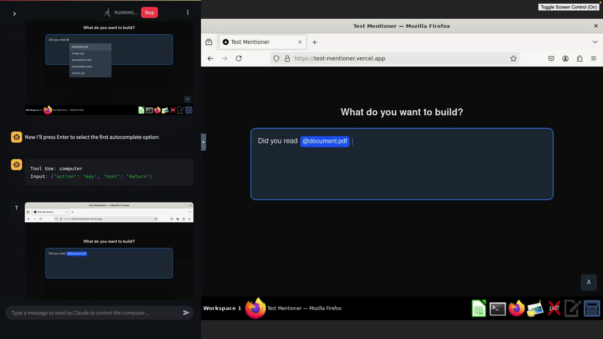

# 08f - Computer Use 简介

《计算机使用》是一项强大的功能，它允许 Claude 直接与桌面环境交互，本质上赋予 AI 像人类一样控制计算机的能力。这项能力为自动化、测试和工作流程辅助开辟了全新的可能性。

## 电脑使用能做什么

与其仅仅生成代码或提供建议，Claude 实际上可以浏览网站、点击按钮、填写表单，并实时与应用程序进行交互。这使得它在执行诸如任务时非常实用：

- Web 应用程序的自动化 QA 测试
- 数据录入和表单填写
- 网站导航和信息收集
- UI 测试和验证
- 重复的桌面任务

## 实际案例：自动化质量保证测试



```
Your goal is to conduct QA testing on a React component hosted at https://test-mentioner.vercel.app/

Testing process:
1. Open a new browser tab
2. Navigate to https://test-mentioner.vercel.app/
3. Execute the test cases below one by one
4. After completing all tests, write a concise report

Test cases:
1. Typing 'Did you read @' should display autocomplete options
2. Typing 'Did you read @' then pressing enter should add '@document.pdf'
3. After adding '@document.pdf', pressing backspace should show autocomplete options directly below the text, not elsewhere on the page
```

