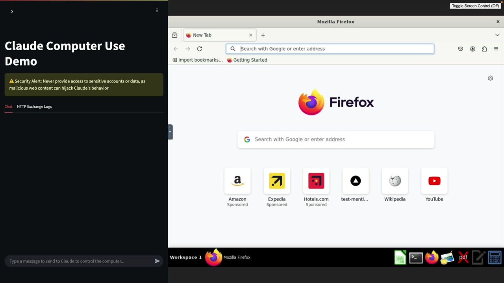

# 08f - Computer Use 原理

在 Claude 中，计算机的使用方式与常规工具使用完全相同——它只是同一基础工具系统的特殊实现。理解这种联系会使计算机使用更容易理解和实施。

## 工具使用复习

在深入了解计算机使用之前，让我们快速回顾一下 Claude 中常规工具的使用方法：

- 您向 Claude 发送一条用户消息，并附带一个工具模式
- Claude 决定需要使用一个工具来回答问题
- Claude 发送一个包含工具名称和输入参数的工具使用请求
- 您的服务器运行实际函数并返回结果
- 您将结果通过工具结果消息发送回 Claude

## 电脑使用：相同流程，不同工具

计算机使用遵循完全相同的模式。关键洞见是计算机使用被实现为一个工具——只是一个可以与桌面环境交互的非常特殊的工具。


这里发生的事情：

- 您包含一个提供计算机交互功能的工具模式
- Claude 决定使用计算机工具
- 而不是运行一个简单的函数，你在计算环境中执行所请求的操作
- 你将结果（如截图）发送回 Claude

## Computer Use 工具 Schema

计算机使用工具模式开始很简单，但会自动扩展成更加全面的东西：


您发送一个基本模式，例如：

```json
{
  "type": "computer_20250124",
  "name": "computer",
  "display_width_px": 1024,
  "display_height_px": 768,
  "display_number": 1
}
```

幕后，这被扩展成一个详细的架构，告诉 Claude 它可以执行以下操作：

- `key` - 按下键盘按键
- `mouse_move` - 移动光标
- `left_click` - 在特定坐标处点击
- `screenshot` - 捕获屏幕截图
- `scroll` - 滚动屏幕

## 计算环境

为了使计算机使用工作，你需要一个实际的计算环境，能够以编程方式执行这些操作。最常见的方法是使用带有桌面环境（如 Firefox）的 Docker 容器。Docker 容器不必复杂——只需支持程序化键盘和鼠标交互。

## 开始使用

您无需从头开始构建计算环境。Anthropic 提供了一种参考实现，处理所有技术细节。


设置它很简单：

- 安装 Docker（你可能已经安装了）
- 运行提供的 Docker 命令并使用您的 API 密钥
- 访问 Web 界面与 Claude 聊天

```sh
export ANTHROPIC_API_KEY="your_api_key"
docker run \
  -e ANTHROPIC_API_KEY=$ANTHROPIC_API_KEY \
  -v $HOME/.anthropic:/home/computeruse/.anthropic \
  -p 5900:5900 \
  -p 8501:8501 \
  -p 6080:6080 \
  -p 8080:8080 \
  -it ghcr.io/anthropics/anthropic-quickstarts:computer-use-demo-latest
```



一旦运行，您将可以访问一个聊天界面，在那里您可以直接测试 Claude 的计算机使用能力。完整的设置指南可在 github.com/anthropics/anthropic-quickstarts 找到。

计算机使用并非魔法——它只是将常规的工具使用系统应用于桌面自动化。Claude 并不直接控制计算机；相反，它通过在受控环境中执行动作来请求工具，由您的代码来满足这些请求。这使得计算机使用既强大又安全，因为您可以完全控制实际执行的动作。
