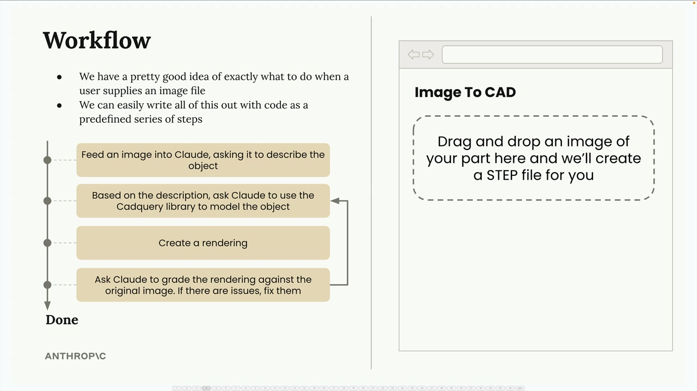
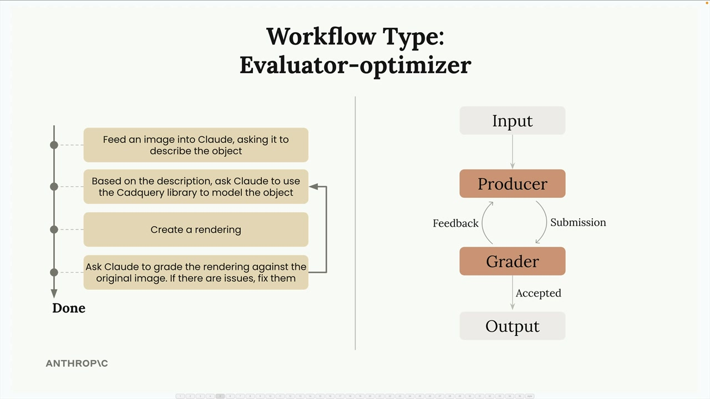

# 09a - Agent 和工作流介绍

Agent 和工作流是用于处理无法通过单个请求完成的用户任务的策略。实际上，前文中我们使用工具并让 Claude 决定如何完成任务时，就创建了一个 Agent。

## 什么时候用什么

工作流是一系列对 Claude 的调用，旨在通过预定步骤解决铁定问题。因此，当你知道 Claude 解决问题时需要经过的确切流程，或者你的应用的 UX 是将用户限制在一系列子任务中时，使用工作流。

Agent 为 Claude 设定一个目标并提供一套工具，期望 Claude 自己找出如何完成目标。因此，当你不确定向 Claude 提供什么任务或任务参数时，使用 Agent。

## 一个工作流的例子

假设我们正在构建一个网页应用，用户拖放金属零件的图片，然后让 Claude 从图片生成 3D 模型的 STEP 文件。

因为我们对用户提供图像文件时应该做什么已经清楚认知，并且可以轻松地用代码写出逻辑作为与定义步骤，因此这个任务适合使用工作流。工作流可分解为：

- 将一张图片输入 Claude，让它描述其中的物体
- 根据描述，让 Claude 使用 CadQuery 库建模该物体
- 创建一个 Rendering
- 让 Claude 根据原始图像对渲染结果评分，如果有问题则修复

这个工作流实际上遵循了“评估-优化”模式，这是一个效果很好的工作流模式：

- 生产者 Producer：接收输入，创建输出
- 评分者 Grader：根据标准评估输出
- 反馈回路 Feedback Loop：如果 Grader 不接受输出，反馈给 Producer 要求改进
- 迭代 Iteration：反复执行反馈回路，直到评分者接受输出

