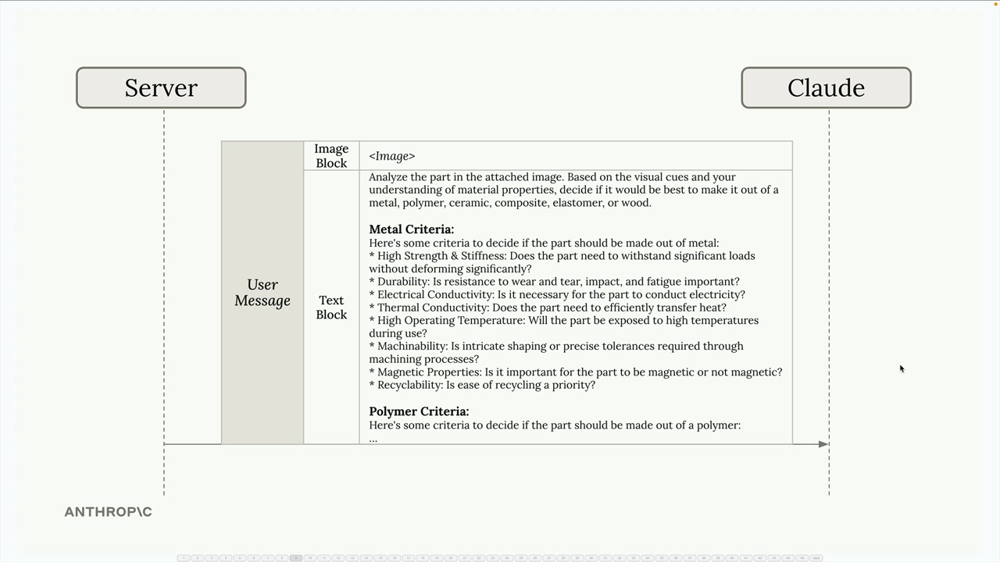

# 09b - 并行式工作流

并行式工作流能帮助你分解复杂的任务为可管理、专门的片段。

## 一个例子

假设我们正在构建一个材料设计应用。用户上传零件图片，应用返回使用的最佳材料的建议。

一个最基础的想法是将图片发送给 Claude，用一个简单的提示词让它选择一系列选项之间的最佳选项，例如：

```
分析图像中的零件，然后在金属、聚合物、陶瓷、复合材料、弹性体或木材中选择一种制造它的最佳材料
```


虽然这种方法可能有效，但 Claude 要在单个请求中承担大量工作，并且缺少专业知识，结果可能不会像预期中那样可靠。

一个直观的改进是，将每种材料的详细标准添加到提示词中，构建一个庞大的提示词但，例如：

```
分析附件图片中的零件。根据视觉线索和您对材料特性的理解，判断该零件最适合用金属、聚合物、陶瓷、复合材料、弹性体还是木材来制造。

金属标准：
以下是判断该零件是否应该用金属制造的标准：
高强度和刚度：该零件是否需要承受重大载荷而不发生明显变形？
耐用性：抗磨损、抗冲击和抗疲劳性能是否重要？
电导率：该零件是否需要导电？
热导率：该零件是否需要高效传热？
高工作温度：该零件在使用过程中是否会暴露在高温环境中？
可加工性：是否需要通过机加工工艺进行复杂成型或达到精确公差？
磁性特性：该零件具有磁性或不具有磁性是否重要？
可回收性：回收的便利性是否是优先考虑因素？

聚合物标准：
以下是判断该零件是否应该用聚合物制造的标准：
...（省略成百上千字） 
```

但这会引发一个新问题 —— Claude 必须同时考虑这些不同因素，可能造成混淆和次优结果。



## 并行式的改进

与其将所有事情塞进一个请求中，你可以将任务拆分成多个并行请求，每个请求专注于使用专门标准评估单一材料类型。交互过程为：

- 将同一张图像多次发送给 Claude
- 每次请求包含针对一种材料的专门标准
- Claude 每次独立评估该材料适用于该零件的程度
- 收集所有分析结果


- 最后一步，将所有单独分析结果再次发送回 Claude，让它比较这些结果并做出最终推荐


## 并行式工作流如何工作

并行式工作流遵循一个简单的结构：

- 将单个任务拆分为多个子任务，将复杂的决策拆分为专门的评估
- 并行运行子任务，加快处理速度
- 汇总结果，整合为最终决策

子任务不必完全相同，每个任务都可以有专门的提示词、工具集或评测标准。


并行式工作流提供了几个关键优势：

- 专注：Claude 不再需要平衡多个相互竞争的考虑因素，从而带来更全面和准确的分析
- 更易优化：可以独立改进和测试每个子任务，调整一个的提示词不会影响其他任务
- 更易扩展：添加新的子任务非常简单，也不会干扰现有任务
- 更可靠：减少了模型认知负担，有助于获取更一致、更可靠的结果

当你可以将复杂的决策拆解为独立的评估时，例如需要 Claude 考虑多个标准、比较多个选项，或涉及不同专业领域决策的情况，则很适合使用并行式工作流。

关键在于识别可以有意义地分离的任务，每个子任务都应该可以独立运行，并为最终决策贡献一部分分析。


