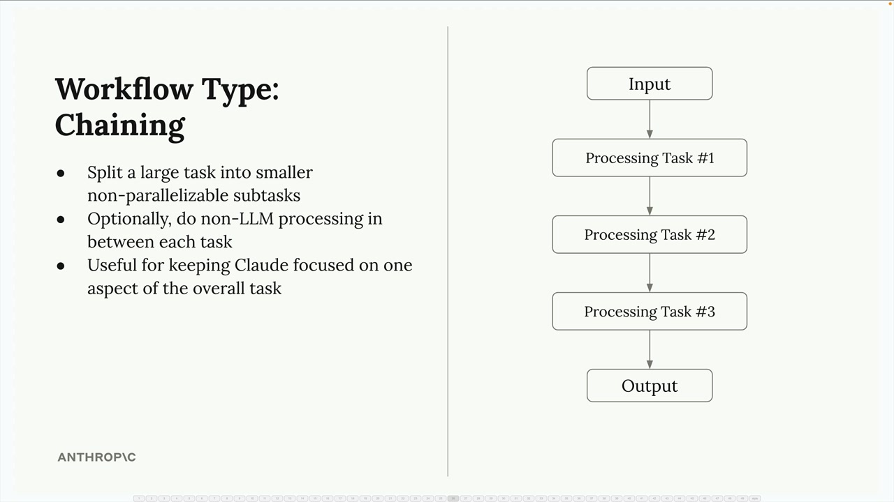

# 09c - 链式工作流

链式串联化的工作流是使用 Claude 时最有用的模式之一，在处理复杂任务或者 Claude 难以持续处理的长提示词时很有价值。

## 定义

串联式工作流将大型任务分解为小的、按顺序（相互依赖）的子任务：



比如这个例子：你在开发一个社交媒体营销工具，可以自动创建和发布视频。可以将工作流分解如下：

- 在 Twitter 上查找相关话题
- 使用 Claude 选择最有趣的话题
- 使用 Claude 研究该话题
- 使用 Claude 编写短视频脚本

- 使用 AI 虚拟形象和 TTS 功能制作视频
- 将视频发布到社交媒体

相比于直接使用一个大型提示词，Claude 每次专注于一个步骤，而不是直接做所有事情，从而获得了如下优势：

- 将大型任务拆分为更小的、不可并行的子任务
- 允许在任务之间进行非 LLM 处理
- Claude 每次专注于整体任务的一个方面

## 长提示词的问题和链式解决方案

一个例子是需要 Claude 根据许多约束来撰写内容的情况。你想让 Claude 写一篇技术文章，并且满足：

- 不要提及这是由 AI 撰写的
- 避免使用表情符号
- 避免使用陈词滥调或过于随意的语言
- 以专业、技术性的口吻撰写

即便明确说明这些限制条件，Claude 生成的内容仍可能不可避免地违反部分约束：


与其在一个庞大的提示词上不断纠结，不如采用两步链式方法：

- 步骤 1：发送初始提示词并接受一个可能不完美的结果；
- 步骤 2：再提出一个专注于解决具体问题的请求，即让 Claude 对步骤 1 的结果有针对性地修改：

```
修改所给的文章。按照以下步骤重写：
1. 找出所有体现作者是 AI 的地方，删除它们；
2. 查找并删除所有表情符号；
3. 定位所有尴尬、幼稚的语句，并用技术型作家会写的文字替换。
```


这种方法之所以有效，是因为 Claude 可以完全专注于修订任务，而不是试图在创作内容与遵守约束之间取得难以衡量的平衡。

## 何时使用

串联式工作流在以下情况下特别有用：

- 任务复杂，具有多重要求
- 使用长提示词时，Claude 反复忽略某些约束
- 需要在步骤之间处理或验证输出
- 希望保持每次交互的专注和可控

相比起试图将所有内容塞入单条提示词，串联式工作流通常能产生更好的结果。关键在于识别任务是否复杂到需要分解为专门的、顺序步骤。


