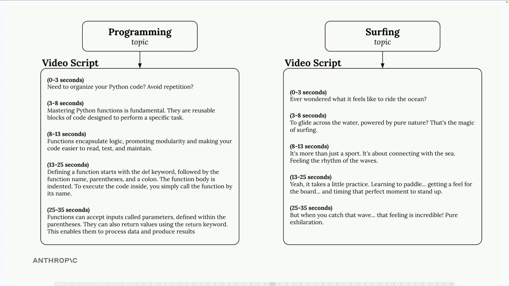

# 09d - 路由式工作流

路由式工作流解决了 AI 应用中的一个常见问题：不同类型的用户请求需要不同的处理方法。相比起使用一刀切式的提示词，路由式工作流可以对传入的请求进行分类，并路由到专门的 Pipeline。

## 通用提示词的问题

考虑从用户话题生成视频脚本的社交媒体营销工具，用户的主题可能是“编程”或“冲浪”，二者应该产生非常不同的内容：“编程”需要解释清晰、定义清楚的教育性内容，“冲浪”则更适合娱乐导向，强调兴奋性和视觉吸引力。而单一的通用提示词很难同时有效处理两者。



## 定义内容类别

为此，我们需要先定义可能生成的内容的不同类型，例如：

- 娱乐 - 高能量、与文化相关的内容，使用时尚的语言
- 教育 - 清晰、引人入胜的解释，配有相关例子
- 喜剧 - 锐利、出人意料的内容，巧妙的评述和恰当的时机
- 个人 Vlog - 真实、亲切的内容，对话式的讲述
- 评论 - 基于经验的确定性内容，突出优点和缺点
- 故事叙述 - 生动的细节和情感连接，沉浸式的内容

随后，为每个类别编写专用的提示词。例如，教育性质内容的提示词可能是要求 Claude “编写一个清晰、引人入胜的脚本，使用例子和启发思考的问题，将复杂信息转化为易于理解的内容”。


## 如何工作

路由过程分为两个步骤：

- 分类 - 将用户的主题发送给 Claude，请求将其分类到预定义的某个类型
- 专门的处理 - 基于分类结果选择合适的提示词，并生成内容

例如，如果用户输入 “Python 函数” 作为主题，可以这样要求 Claude 进行分类：

```
将视频的主题归类到列出的类别之一：
<topic>Python 函数</topic>

<categories>
- 教育
- 娱乐
- 喜剧
- 个人 Vlog
- 评论
- 故事叙述
</categories>
```

## 路由式工作流架构


路由式工作流遵循以下模式：

- 用户输入首先被发送到路由组件
- 调用 Claude 对请求进行分类
- 根据分类，输入被转发到特定的 Pipeline
- 每个 Pipeline 都有自己的工作流、提示词或优化过的工具

关键是使用户输入只流向一个专门的 Pipeline，从而允许每个 Pipeline 针对其特定用例进行高度优化。

## 何时使用

路由式工作流在以下情况表现良好：

- 你的应用处理多种类型的请求，需要不同的处理方法
- 你可以明确定义出各种类别
- “分类”步骤可以由 Claude 可靠地处理
- “专门的处理”步骤的带来的性能优势超过“分类”步骤的开销

这种模式对于

- 客服机器人
- 内容生成工具
- 其他高度依赖于理解请求类型来生成正确回复的应用

来说很有价值。
