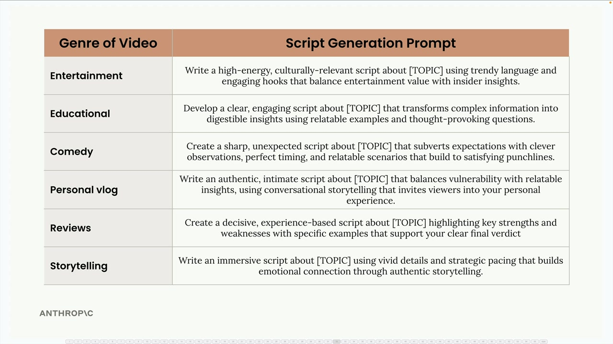
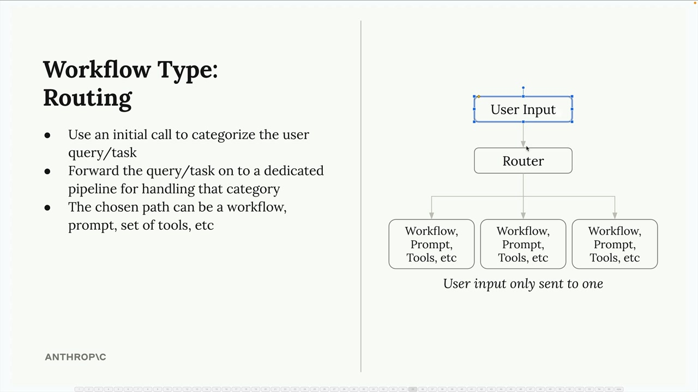

# 09d - 路由式工作流

路由工作流解决了人工智能应用中一个常见问题：不同类型的用户请求需要不同的处理方法。您不必使用一刀切式的提示，而是可以对传入的请求进行分类并将它们路由到专门的加工管道。

## 通用提示的问题

考虑一个从用户话题生成视频脚本的社交媒体营销工具。用户可能会输入“编程”或“冲浪”作为他们的主题，但这些应该产生非常不同类型的内容：


编程主题需要具有清晰解释和定义的教育内容。冲浪主题则更适合以娱乐为导向的脚本，强调兴奋和视觉吸引力。单一的通用提示无法有效处理两者。

## 设置内容类别

第一步是定义应用程序可能需要生成的内容的不同类型。您可以将请求分类为以下类型：

- 娱乐 - 高能量、与文化相关的内容，使用时尚的语言
- 教育 - 清晰、引人入胜的解释，配有相关实例
- 喜剧 - 锋利、出乎意料
- 个人博客 - 真实、亲密的内容，以对话式的叙述的内含，巧妙观察和时机
- 评论 - 决定性、基于经验的内容，突出优点和缺点
- 故事讲述 - 通过生动的细节和情感联系实现沉浸式内容

每个类别都有自己的专用提示模板。例如，教育提示可能会要求 Claude“编写一个清晰、引人入胜的脚本，将复杂信息转化为易于理解的见解，使用相关示例和引人深思的问题。”



## 实际中路由是如何工作的

路由过程分为两个步骤：

- 分类 - 将用户的主题发送给 Claude，请求将其分类到您预定义的某个类型
- 专业处理 - 使用分类结果选择合适的提示模板并生成内容

例如，如果用户输入“Python 函数”作为他们的主题，你首先会要求 Claude 对其进行分类：

```
Categorize the topic of a video into one of the listed categories:
<topic>Python functions</topic>

<categories>
- Educational
- Entertainment  
- Comedy
- Personal vlog
- Reviews
- Storytelling
</categories>
```

Claude 回复“教育”，然后您就使用教育提示模板来生成实际的脚本内容。

## 路由工作流架构



一个路由工作流程遵循以下模式：

- 用户输入首先发送到路由器组件
- 路由器使用初始的 Claude 调用对请求进行分类
- 根据分类，输入被转发到特定的处理管道
- 每个管道都可以有自己的工作流程、提示或针对该类别的优化工具

关键洞察是用户输入只流向一个专门的管道，而不是所有管道。这允许每个管道针对其特定的用例进行高度优化。

## 何时使用

路由工作流在以下情况下表现良好：

- 您的应用程序处理多种类型的请求，需要不同的处理方法
- 您可以明确定义涵盖您用例的类别
- 分类步骤可以由 Claude 可靠地处理
- 专用处理的性能优势超过了路由步骤的开销

这种模式对于客户服务机器人、内容生成工具以及任何“正确”的回复高度依赖于理解请求类型的应用程序来说尤其有价值。
