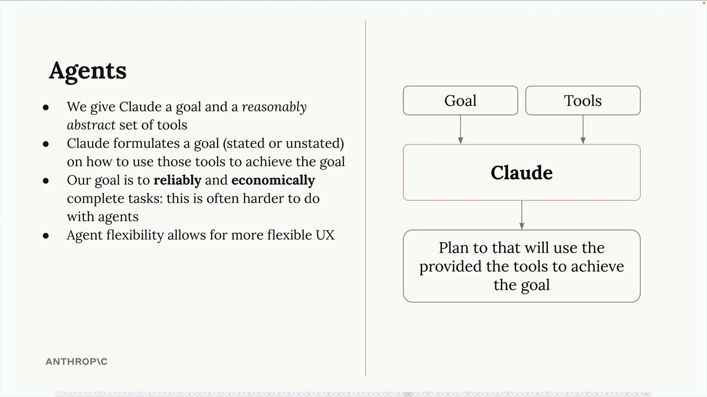
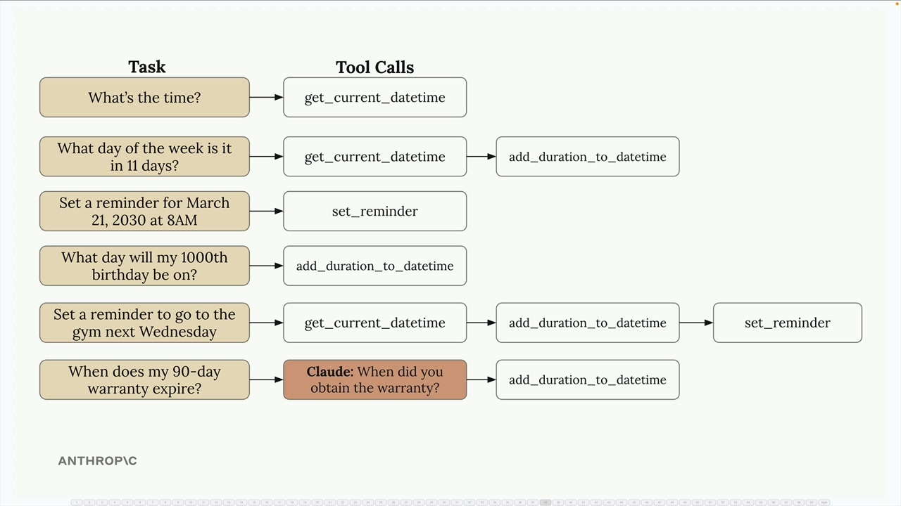
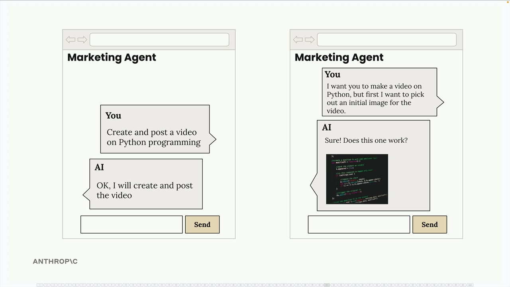

# 09e - Agent 和工具

代理代表了一种从我们一直使用的结构化工作流程的转变。当您知道完成任务所需的精确步骤时，工作流程是完美的，而当您不确定这些步骤应该是什么时，代理就大放异彩。您不是定义一个严格的顺序，而是给 Claude 一个目标和一系列工具，然后让它想出如何组合这些工具来实现目标。

这种灵活性使得代理对于构建需要处理各种不可预测任务的程序很有吸引力。您可以创建一个代理，确保它工作得相当好，然后部署它来解决广泛的问题。然而，这种灵活性在可靠性和成本方面也存在权衡，我们将在稍后探讨。

## How Tools Make the Agent

代理的真实力量在于它们能够以意想不到的方式组合简单的工具。考虑一组基本的日期时间工具：

- `get_current_datetime` - 获取当前日期和时间
- `add_duration_to_datetime` - 给指定日期添加时间
- `set_reminder` - 为特定时间创建提醒

这些工具单独看起来很简单，但 Claude 可以将它们串联起来，以处理令人惊讶的复杂请求：

对于“现在几点了？”这个问题，Claude 简单地调用 `get_current_datetime` 。但对于“11 天后是星期几？”这样的问题，它会先调用 `get_current_datetime` ，然后是 `add_duration_to_datetime` 。在设置下周三的健身房提醒时，它可能会依次使用这三个工具。

Claude 甚至能识别何时需要更多信息。如果你问“我的 90 天保修期何时到期？”，它会先询问你购买商品的日期，然后再计算到期日。

## 工具应该是抽象的

构建有效代理的关键洞察是提供合理抽象的工具而不是高度专业化的工具。Claude Code 完美地展示了这一原则。

Claude Code 可以访问通用、灵活的工具，例如：

- `bash` - 运行任何命令
- `read` - 读取任何文件
- `write` - 创建任何文件
- `edit` - 修改文件
- `glob` - 查找文件
- `grep` - 搜索文件内容

它特别没有像“重构代码”或“安装依赖”这样的专用工具。相反，Claude 会想出如何使用基本工具来完成这些复杂任务。这种抽象允许它处理开发者从未明确计划过的无数编程场景。

## 最佳实践：可组合工具

在设计智能体时，提供 Claude 可以以创新方式组合的工具。例如，一个社交媒体视频智能体可能包括：

- `bash` - 访问 FFMPEG 进行视频处理
- `generate_image` - 根据提示创建图像
- `text_to_speech` - 将文本转换为音频
- `post_media` - 将内容上传到社交平台

此工具集既支持简单的流程（创建并发布视频），也支持更互动的体验，其中代理可能首先生成一个样本图像，获取用户批准，然后继续进行视频制作。

智能体可以根据用户反馈和偏好调整其方法，这是在僵化的工作流程中难以实现的。这种灵活性是智能体在构建动态、用户响应型应用中的强大之处。
