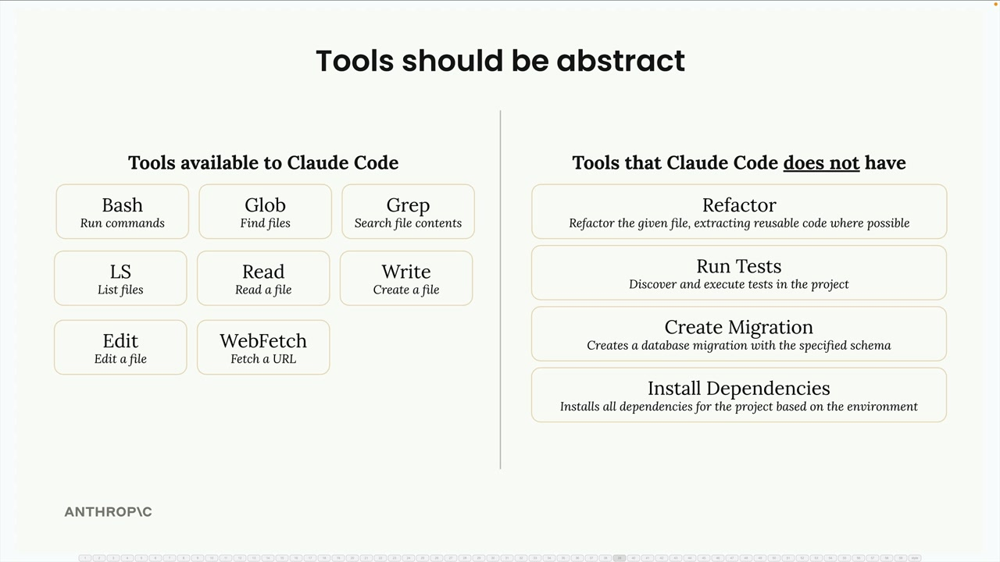
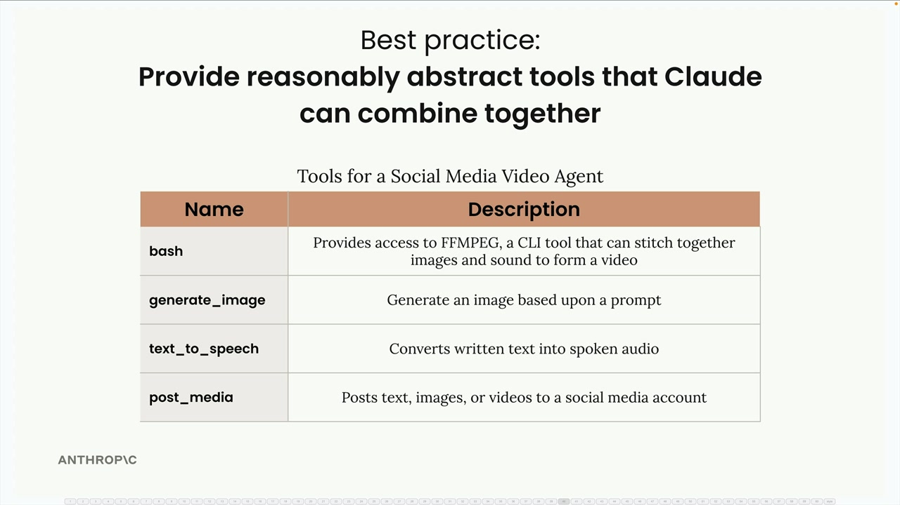

# 09e - Agent 和工具

Agent 代表着从结构化的工作流的转变。当你知道完成任务所需的确切步骤时，工作流是合适的；而当你不确定具体的步骤应该是什么时，Agent 就有效了。

构建 Agent 时，开发者不是定义一个严格的顺序，而是给 Claude 一个目标和一系列工具，然后由它想出如何组合这些工具来实现目标。

这种灵活性使得 Agent 在处理各种不可预测的任务时很有吸引力。一个可靠的 Agent 能用来解决广泛的问题。然而，这种灵活性在可靠性和成本方面也存在权衡，我们将在稍后探讨。

## 工具之于 Agent

Agent 的力量在于它能够以意想不到的方式组合使用简单的工具来达成目标。考虑一组基本的日期时间工具：

- `get_current_datetime`
- `add_duration_to_datetime`
- `set_reminder`

这些工具单独看起来很简单，但 Claude 可以综合使用它们，以处理各种复杂请求：

- 对于“现在几点了？”，Claude 简单地调用 `get_current_datetime`
- 对于“11 天后是星期几？”，Claude 先调用 `get_current_datetime` ，然后 `add_duration_to_datetime`
- 设置下周三的健身房提醒时，Claude 可能会依次使用这三个工具
- 如果问“我的 90 天保修期何时到期？”，Claude 甚至能发现需要更多信息：它会先询问你购买商品的日期，然后再计算到期日

## 工具应该是抽象的

构建有效的 Agent 的关键是提供合理抽象的工具，而不是高度专门化的工具。Claude Code 就展示了这一原则：

Claude Code 可以使用通用、灵活的工具，例如：

- `bash` - 运行命令
- `read` - 读取文件
- `write` - 创建文件
- `edit` - 修改文件
- `glob` - 查找文件
- `grep` - 搜索文件内容

它没有像“重构代码”或“安装依赖”这样的专用工具。相反，Claude 会想出如何组合基本工具来完成这些复杂任务。工具的抽象允许它处理 Agent 开发者从未明确考虑、设计过的无数种编程场景。

## 最佳实践：可组合的工具

在设计 Agent 时，给 Claude 可以以创新方式组合的工具。例如，一个社交媒体视频 Agent 可能包括：

- `bash` - 用 ffmpeg 进行视频处理
- `generate_image` - 根据提示词生成图像
- `text_to_speech` - 将文本转换为音频
- `post_media` - 将内容上传到社交平台

这套工具集既支持：

- 简单的流程：创建并发布视频
- 也支持互动的体验：Agent 可能先生成一个样本图像，待用户认可后，继续进行视频制作

Agent 可以根据用户反馈和偏好调整其解决方案，这是在固定的工作流中难以实现的。这种灵活性使得 Agent 在构建动态的、用户响应式的应用时相当强大。
