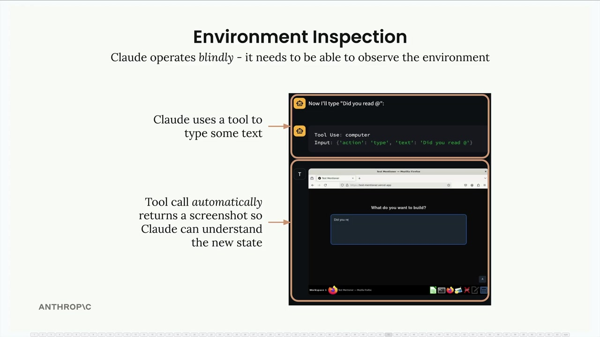
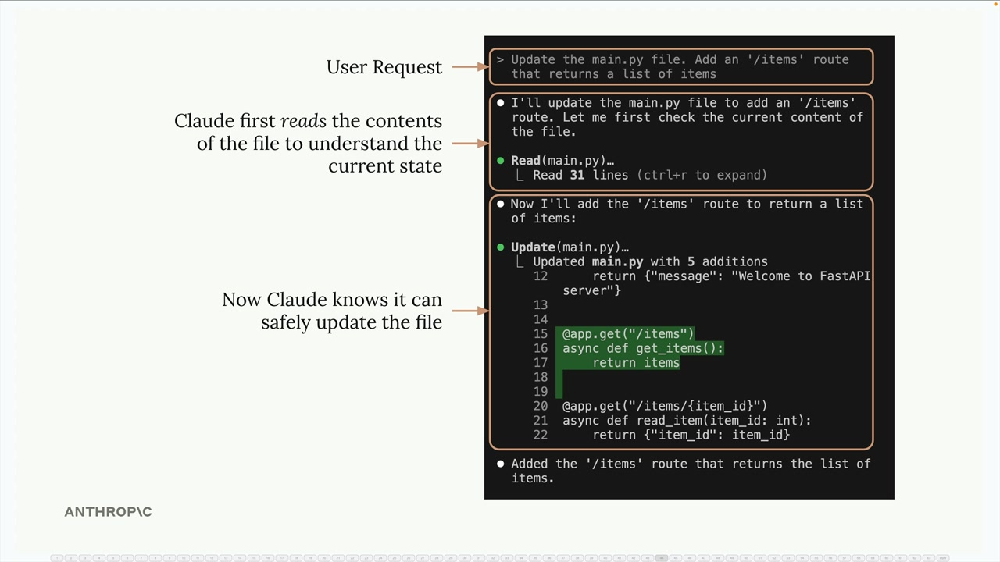
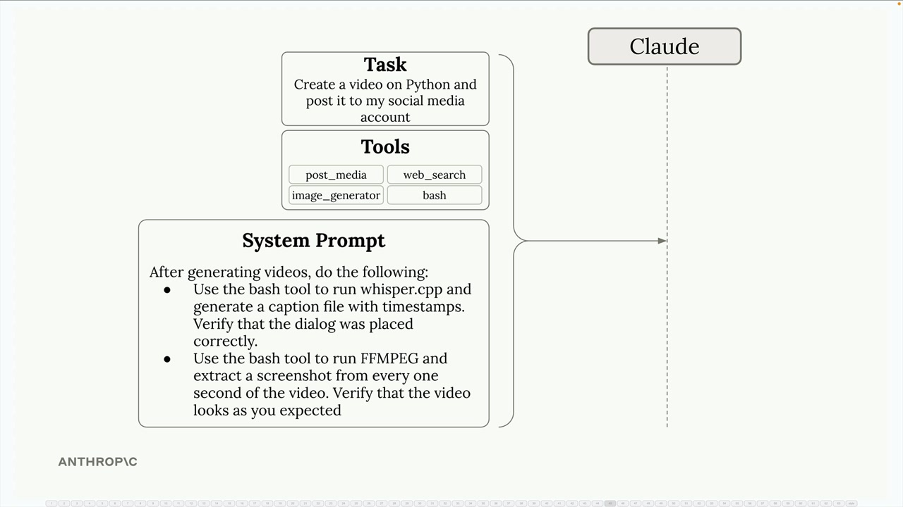

# 09f - 环境感知

在构建 AI Agent 时，一个经常被忽略的关键是环境感知。Claude 需要能观察和理解其行动的结果，才能有效工作，避免盲目。

考虑 Claude 与 Computer Use 协同的场景，每当 Claude 执行诸如输入文本或点击按钮等操作时，需要立即收到一张截图，从而理解其操作是否成功、环境发生了什么。



这一原则同样适用于文件操作。Claude 修改任何文件之前，需要了解当前的内容。这看起来或许很显然，但却是构建 Agent 时应始终遵循的模式。在下列示例中，当被要求向 Python 文件中添加新路由时，Claude 首先阅读现有代码以了解当前结构，才能安全地做出更改，而不破坏现有功能。



## 系统提示词引导下的环境感知

你可以通过系统提示词引导 Claude 检查其环境。对于复杂任务这尤为重要。



考虑一个需要以下功能的视频创作 Agent：

- 使用 FFmpeg 等工具生成视频内容
- 确认对白音频被添加在正确位置
- 检查视觉元素是否如预期出现

可能使用的系统提示词例如：

```
- 使用 bash 工具运行 whisper.cpp 生成语音，并生成带时间戳的字幕文件
- 使用 FFmpeg 以固定间隔从创作的视频中截图，以直观地检查输出
- 将生成的内容与原始需求进行对比
```

## 环境感知的优势

当 Claude 能够检查其环境时，能带来：

- 更好的进度跟踪：Claude 可以评估它完成任务的进度
- 错误处理：Claude 可以检测到意外结果，并尝试自愈
- 质量保证：在声称任务完成之前，Claude 可以对输出进行验证
- 自适应行为（ReAct Agent）：Claude 可以根据观察到的内容调整其解决问题的方法

## 实际应用

在设计 Agent 时，要多问问自己：“Claude 如何知道这个动作是否成功？”无论是在进行文件处理、API 调用，还是 UI 操作，都应提供工具和提示词，引导 Claude 观察其动作的结果。例如：

- 在修改文件前先读取文件内容
- 在 UI 交互后截取屏幕
- 查看 API 响应以获取期望的数据
- 验证生成的内容是否符合要求

环境感知将 Claude 从一个盲目的命令执行者，转变为能够理解和适应其工作环境的“智能体”。
